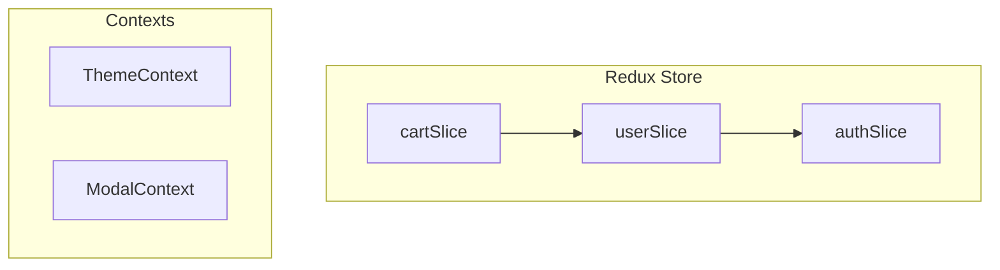
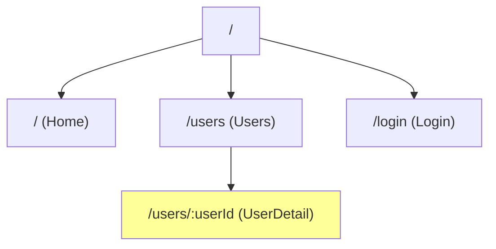
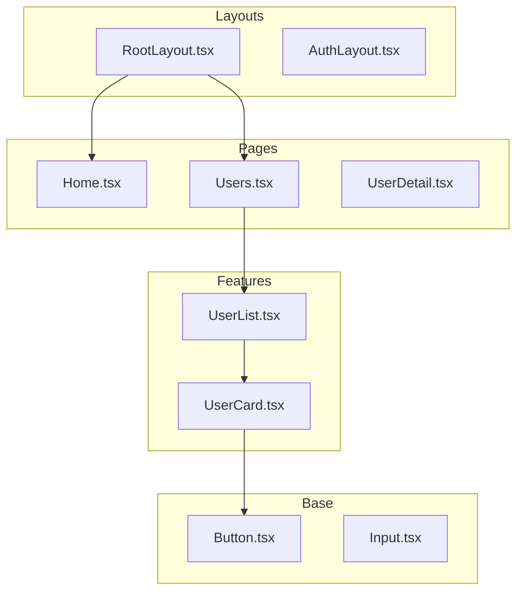
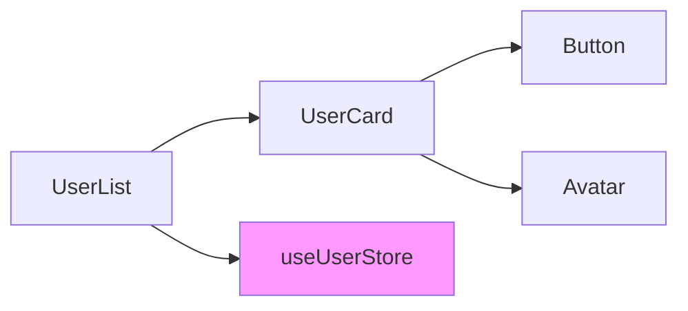
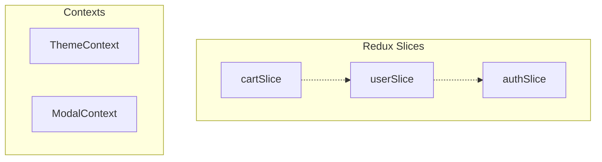
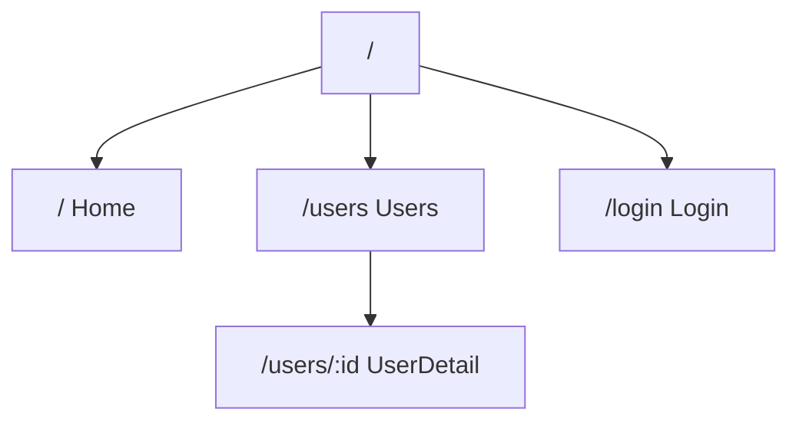

# React Project Analyzer

React 프로젝트의 구조, 컴포넌트 의존성, 상태관리, 라우팅을 분석하여 종합 문서를 생성합니다.

## 실행 프로세스 개요

```
┌─────────────────────────────────────────────────────────────────┐
│              REACT PROJECT ANALYSIS PROCESS                      │
├─────────────────────────────────────────────────────────────────┤
│                                                                  │
│  Phase 0: INTENT CLARIFICATION (선택)                            │
│     └─ 프로젝트 경로 확인/자동 탐색                               │
│                                                                  │
│  Phase 1: PROJECT META DISCOVERY                                 │
│     └─ package.json 분석                                         │
│     └─ React 버전 감지 (17.x/18.x/19.x)                         │
│     └─ 빌드 도구 감지 (Vite/CRA/Next.js/Remix)                   │
│                                                                  │
│  Phase 2: DIRECTORY STRUCTURE ANALYSIS                           │
│     └─ 소스 구조 파악                                            │
│     └─ 컴포넌트/store/router 위치 식별                            │
│                                                                  │
│  Phase 3: COMPONENT ANALYSIS                                     │
│     └─ .tsx/.jsx 파일 스캔 및 파싱                               │
│     └─ 컴포넌트 분류 (Page, Layout, Container, Feature, etc.)   │
│     └─ 의존성 그래프 구축                                        │
│                                                                  │
│  Phase 4: STATE MANAGEMENT ANALYSIS                              │
│     └─ Redux Toolkit slices 분석                                 │
│     └─ Zustand stores 분석                                       │
│     └─ Context API providers 분석                                │
│                                                                  │
│  Phase 5: ROUTING ANALYSIS                                       │
│     └─ 라우트 트리 구조                                          │
│     └─ 동적/중첩 라우트                                          │
│     └─ loader/action 함수                                        │
│                                                                  │
│  Phase 6: HOOKS & UTILITIES ANALYSIS                             │
│     └─ 커스텀 Hooks 분석                                         │
│     └─ 유틸리티 함수 식별                                        │
│                                                                  │
│  Phase 7: DOCUMENTATION                                          │
│     └─ ARCHITECTURE.md 생성                                      │
│     └─ analysis-data.json 생성                                   │
│     └─ Mermaid 다이어그램 생성                                   │
│                                                                  │
│  Phase 8: VERIFICATION                                           │
│     └─ 자동/수동 검증                                            │
│                                                                  │
└─────────────────────────────────────────────────────────────────┘
```

---

## Phase 0: 의도 명확화 (선택적)

프로젝트 경로가 명시되지 않은 경우 자동 탐색 또는 확인합니다.

### 자동 탐색

```bash
# 현재 디렉토리에서 React 프로젝트 확인
test -f "package.json" && grep -q "react" package.json && echo "React 프로젝트 발견"

# 또는 하위 디렉토리 탐색
find . -maxdepth 2 -name "package.json" -exec grep -l "\"react\"" {} \; | head -1
```

### 확인 사항

| 항목 | 확인 방법 | 기본값 |
|------|----------|--------|
| project_path | 자동 탐색 또는 사용자 입력 | 현재 디렉토리 |
| output_dir | 사용자 입력 | `./docs/architecture` |
| analysis_depth | 사용자 선택 | `shallow` |

---

## Phase 1: 프로젝트 메타 파악

### 1.1 package.json 분석

```json
{
  "name": "my-react-app",
  "dependencies": {
    "react": "^19.1.0",           // React 버전
    "react-dom": "^19.1.0",       // React DOM 버전
    "react-router": "^7.5.1",     // 라우터 버전
    "@reduxjs/toolkit": "^2.2.7"  // 상태관리
  },
  "devDependencies": {
    "@vitejs/plugin-react": "^7.0.5"  // 빌드 도구
  }
}
```

### 1.2 React 버전 감지

| 감지 대상 | React 17 지표 | React 18+ 지표 | React 19 지표 |
|----------|--------------|---------------|---------------|
| 패키지 버전 | `react@17.x` | `react@18.x` | `react@19.x` |
| 렌더링 | `ReactDOM.render` | `createRoot` | `createRoot` |
| 동시성 | N/A | `useTransition` | `use()` hook |
| 서버 컴포넌트 | N/A | 실험적 | 네이티브 지원 |

### 1.3 빌드 도구 감지

| 빌드 도구 | 감지 파일/패턴 |
|-----------|--------------|
| **Vite** | `vite.config.{js,ts}`, `@vitejs/plugin-react` |
| **CRA** | `react-scripts`, `react-app-rewired` |
| **Next.js** | `next.config.{js,ts,mjs}`, `next` |
| **Remix** | `remix.config.{js,ts}`, `@remix-run/*` |
| **Webpack** | `webpack.config.{js,ts}`, custom setup |

### 1.4 상태관리 감지

| 상태관리 | 감지 패턴 |
|----------|----------|
| **Redux Toolkit** | `@reduxjs/toolkit`, `createSlice` |
| **Zustand** | `zustand`, `create()` |
| **Jotai** | `jotai`, `atom()` |
| **Recoil** | `recoil`, `atom()`, `selector()` |
| **Context API** | `createContext`, `useContext` |

### 1.5 스타일링 감지

| 스타일링 | 감지 패턴 |
|----------|----------|
| **styled-components** | `styled-components`, `styled.*` |
| **Emotion** | `@emotion/react`, `@emotion/styled` |
| **CSS Modules** | `*.module.css`, `*.module.scss` |
| **Tailwind CSS** | `tailwindcss`, `tailwind.config.*` |
| **Sass/SCSS** | `*.scss`, `sass` |

### 1.6 수집 데이터

```json
{
  "projectMeta": {
    "name": "my-react-app",
    "reactVersion": "19.1.0",
    "reactGeneration": "19.x",
    "buildTool": "vite",
    "typescript": true,
    "stateManagement": ["redux-toolkit"],
    "router": "react-router@7.x",
    "styling": "styled-components",
    "uiFramework": null
  }
}
```

---

## Phase 2: 디렉토리 구조 분석

### 2.1 일반적인 React 프로젝트 구조

```
src/
├── assets/           # 정적 자원
├── components/       # 재사용 컴포넌트
│   ├── common/       # 공통 컴포넌트
│   ├── ui/           # 기초 UI 컴포넌트
│   └── features/     # 기능별 컴포넌트
├── pages/            # 페이지 컴포넌트 (또는 views/, routes/)
├── layouts/          # 레이아웃 컴포넌트
├── features/         # Feature-based 구조
├── store/            # Redux store (또는 stores/)
│   └── slices/       # Redux slices
├── hooks/            # 커스텀 Hooks
├── contexts/         # Context providers
├── router/           # 라우터 설정
├── utils/            # 유틸리티 함수
├── types/            # TypeScript 타입
├── styles/           # 전역 스타일
└── App.tsx           # 루트 컴포넌트
```

### 2.2 디렉토리 스캔 전략

```
1. src/ 디렉토리 존재 확인
2. 컴포넌트 위치 패턴 탐색:
   - src/components/**/*.{tsx,jsx}
   - src/pages/**/*.{tsx,jsx} (또는 views/, routes/)
   - src/layouts/**/*.{tsx,jsx}
   - src/features/**/*.{tsx,jsx}
3. 상태관리 위치 탐색:
   - src/store/**/*.{js,ts} (Redux)
   - src/stores/**/*.{js,ts} (Zustand)
   - src/contexts/**/*.{tsx,jsx} (Context)
4. 라우터 위치 탐색:
   - src/router/**/*.{tsx,jsx,ts,js}
   - src/routes/**/*.{tsx,jsx,ts,js}
```

---

## Phase 3: 컴포넌트 분석

### 3.1 컴포넌트 분류 기준

| 카테고리 | 패턴 | 설명 |
|----------|------|------|
| **Page** | `pages/**`, `views/**`, `routes/**` | 라우트 엔드포인트 |
| **Layout** | `layouts/**`, `*Layout.tsx` | 레이아웃 래퍼 |
| **Container** | `containers/**`, `*Container.tsx` | 비즈니스 로직 |
| **Feature** | `features/**`, `modules/**` | 기능별 컴포넌트 |
| **Common** | `components/common/**`, `shared/**` | 공통 UI |
| **Base** | `components/ui/**`, `components/base/**` | 기초 UI |

### 3.1.1 컴포넌트 분류 가이드 (보강)

> **📌 Feedback Loop 개선**: 이 섹션은 반복적인 컴포넌트 분류 수정 피드백을 반영하여 추가되었습니다.

#### 분류 우선순위

디렉토리 구조만으로 판단이 어려운 경우 다음 우선순위를 따르세요:

1. **디렉토리 위치** (1순위): 위 패턴 테이블 참조
2. **파일명 접미사** (2순위): `*Page`, `*Layout`, `*Container` 등
3. **컴포넌트 역할** (3순위): 코드 분석으로 판단

#### 모호한 케이스 처리

| 상황 | 판단 기준 | 분류 |
|------|----------|------|
| `components/` 직하에 있는 파일 | 재사용 범위 확인 | 2곳 이상 사용 → **Common**, 1곳만 사용 → **Feature** |
| `*Modal`, `*Dialog` 컴포넌트 | 범용성 확인 | 범용 → **Common**, 특정 기능용 → **Feature** |
| HOC, Provider 래퍼 | 역할 확인 | 레이아웃 역할 → **Layout**, 상태 공급 → Context로 분류 |
| `index.tsx` 배럴 파일 | 내보내기만 하면 제외 | 분석에서 제외 |
| Compound 컴포넌트 (`Tabs.Root`, `Tabs.Item`) | 부모 컴포넌트 기준 | 부모와 동일 카테고리 |

#### 컴포넌트 분류 체크리스트

```
✅ 분류 전 확인사항:
□ 디렉토리 구조가 표준 패턴을 따르는가?
□ 파일명에 역할을 나타내는 접미사가 있는가?
□ 라우터에 직접 연결된 컴포넌트인가? (→ Page)
□ children을 감싸는 래퍼 역할인가? (→ Layout)
□ 비즈니스 로직(API, store 연결)이 있는가? (→ Container/Feature)
□ 2곳 이상에서 재사용되는가? (→ Common)
□ 스타일링만 담당하는 기초 UI인가? (→ Base)
```

#### 출력 예시 (analysis-data.json 컴포넌트 섹션)

```json
{
  "components": [
    {
      "name": "UserCard",
      "path": "src/components/features/user/UserCard.tsx",
      "category": "Feature",
      "classification_reason": "features/ 디렉토리 위치",
      "props": ["userId: string", "onSelect?: (user: User) => void"],
      "hooks": ["useState", "useSelector", "useAuth"],
      "dependencies": ["Button", "Avatar"],
      "used_by": ["UserList", "UserProfile"],
      "lines_of_code": 45
    },
    {
      "name": "Button",
      "path": "src/components/ui/Button.tsx",
      "category": "Base",
      "classification_reason": "components/ui/ 디렉토리 위치",
      "props": ["variant?: 'primary' | 'secondary'", "size?: 'sm' | 'md' | 'lg'"],
      "hooks": [],
      "dependencies": [],
      "used_by": ["UserCard", "LoginForm", "Header"],
      "lines_of_code": 28
    }
  ]
}
```

### 3.2 함수형 컴포넌트 파싱

#### TypeScript + React (권장 패턴)

```tsx
// 컴포넌트 정의
import { useState, useEffect } from 'react'
import { useDispatch, useSelector } from 'react-redux'
import Button from '@/components/ui/Button'
import { useAuth } from '@/hooks/useAuth'
import type { User } from '@/types'

interface Props {
  userId: string
  onSelect?: (user: User) => void
}

export function UserCard({ userId, onSelect }: Props) {
  const [isLoading, setIsLoading] = useState(false)
  const user = useSelector(selectUserById(userId))
  const dispatch = useDispatch()
  const { isAuthenticated } = useAuth()

  useEffect(() => {
    // ...
  }, [userId])

  return (
    <div>
      <Button onClick={() => onSelect?.(user)}>Select</Button>
    </div>
  )
}
```

**추출 정보:**
- `interface Props`: Props 정의
- `useState`, `useSelector` 등: 사용된 Hooks
- `import` 문: 컴포넌트 의존성
- `useAuth`: 커스텀 Hook 사용

#### forwardRef 패턴

```tsx
import { forwardRef } from 'react'

interface InputProps extends React.InputHTMLAttributes<HTMLInputElement> {
  label?: string
}

export const Input = forwardRef<HTMLInputElement, InputProps>(
  ({ label, ...props }, ref) => {
    return (
      <div>
        {label && <label>{label}</label>}
        <input ref={ref} {...props} />
      </div>
    )
  }
)
```

### 3.3 의존성 그래프 구축

```
컴포넌트 A
  ├── import → 컴포넌트 B
  ├── import → 컴포넌트 C
  ├── import → hooks/useAuth
  └── import → store/slices/userSlice
```

**분석 방법:**
1. `import` 문에서 `.tsx/.jsx` 파일 추출
2. 동적 import `React.lazy(() => import('...'))` 감지
3. alias 경로 해석 (`@/`, `~/`, `src/`)
4. 상대 경로 해석 (`./`, `../`)

### 3.4 Alias 경로 해석

```typescript
// vite.config.ts
resolve: {
  alias: {
    '@': path.resolve(__dirname, 'src'),
    '@components': path.resolve(__dirname, 'src/components')
  }
}

// tsconfig.json
{
  "compilerOptions": {
    "paths": {
      "@/*": ["src/*"],
      "@components/*": ["src/components/*"]
    }
  }
}
```

---

## Phase 4: 상태관리 분석

### 4.1 Redux Toolkit 분석

```typescript
// store/slices/userSlice.ts
import { createSlice, createAsyncThunk } from '@reduxjs/toolkit'
import type { PayloadAction } from '@reduxjs/toolkit'

interface UserState {
  users: User[]
  currentUser: User | null
  status: 'idle' | 'loading' | 'succeeded' | 'failed'
}

const initialState: UserState = {
  users: [],
  currentUser: null,
  status: 'idle'
}

// Async Thunk
export const fetchUsers = createAsyncThunk(
  'user/fetchUsers',
  async () => {
    const response = await api.getUsers()
    return response.data
  }
)

// Slice
export const userSlice = createSlice({
  name: 'user',
  initialState,
  reducers: {
    setCurrentUser: (state, action: PayloadAction<User>) => {
      state.currentUser = action.payload
    },
    clearCurrentUser: (state) => {
      state.currentUser = null
    }
  },
  extraReducers: (builder) => {
    builder
      .addCase(fetchUsers.pending, (state) => {
        state.status = 'loading'
      })
      .addCase(fetchUsers.fulfilled, (state, action) => {
        state.status = 'succeeded'
        state.users = action.payload
      })
  }
})

// Actions & Selectors
export const { setCurrentUser, clearCurrentUser } = userSlice.actions
export const selectAllUsers = (state: RootState) => state.user.users
export const selectCurrentUser = (state: RootState) => state.user.currentUser

export default userSlice.reducer
```

**추출 정보:**
| 항목 | 추출 방법 |
|------|----------|
| Slice 이름 | `createSlice({ name: '...' })` |
| State | `initialState` 타입 |
| Reducers | `reducers` 속성 |
| Async Thunks | `createAsyncThunk` 호출 |
| Selectors | `select*` 함수 |
| Actions | `slice.actions` 내보내기 |

### 4.2 Zustand Store 분석

```typescript
// stores/userStore.ts
import { create } from 'zustand'
import { devtools, persist } from 'zustand/middleware'

interface UserState {
  users: User[]
  currentUser: User | null
  fetchUsers: () => Promise<void>
  setCurrentUser: (user: User) => void
  clearCurrentUser: () => void
}

export const useUserStore = create<UserState>()(
  devtools(
    persist(
      (set, get) => ({
        users: [],
        currentUser: null,

        fetchUsers: async () => {
          const users = await api.getUsers()
          set({ users })
        },

        setCurrentUser: (user) => set({ currentUser: user }),
        clearCurrentUser: () => set({ currentUser: null })
      }),
      { name: 'user-storage' }
    )
  )
)
```

### 4.3 Context API 분석

```tsx
// contexts/AuthContext.tsx
import { createContext, useContext, useState, ReactNode } from 'react'

interface AuthContextType {
  user: User | null
  login: (credentials: Credentials) => Promise<void>
  logout: () => void
  isAuthenticated: boolean
}

const AuthContext = createContext<AuthContextType | undefined>(undefined)

export function AuthProvider({ children }: { children: ReactNode }) {
  const [user, setUser] = useState<User | null>(null)

  const login = async (credentials: Credentials) => {
    const user = await api.login(credentials)
    setUser(user)
  }

  const logout = () => setUser(null)

  return (
    <AuthContext.Provider value={{ user, login, logout, isAuthenticated: !!user }}>
      {children}
    </AuthContext.Provider>
  )
}

export function useAuth() {
  const context = useContext(AuthContext)
  if (!context) throw new Error('useAuth must be used within AuthProvider')
  return context
}
```

### 4.4 상태관리 구조 다이어그램



---

## Phase 5: 라우팅 분석

### 5.1 React Router v7 (Data Router)

```tsx
// router/index.tsx
import { createBrowserRouter, RouterProvider } from 'react-router'
import { lazy, Suspense } from 'react'

const Home = lazy(() => import('@/pages/Home'))
const Users = lazy(() => import('@/pages/Users'))
const UserDetail = lazy(() => import('@/pages/UserDetail'))

const router = createBrowserRouter([
  {
    path: '/',
    element: <RootLayout />,
    errorElement: <ErrorBoundary />,
    children: [
      {
        index: true,
        element: <Home />,
        loader: homeLoader
      },
      {
        path: 'users',
        element: <Users />,
        loader: usersLoader,
        action: createUserAction,
        children: [
          {
            path: ':userId',
            element: <UserDetail />,
            loader: userDetailLoader,
            action: updateUserAction
          }
        ]
      },
      {
        path: 'login',
        element: <Login />
      }
    ]
  }
])

export function AppRouter() {
  return (
    <Suspense fallback={<Loading />}>
      <RouterProvider router={router} />
    </Suspense>
  )
}
```

### 5.2 추출 정보

| 항목 | 설명 |
|------|------|
| **path** | 라우트 경로 |
| **element** | 연결된 컴포넌트 |
| **loader** | 데이터 로딩 함수 |
| **action** | 폼 액션 함수 |
| **children** | 중첩 라우트 |
| **errorElement** | 에러 처리 컴포넌트 |
| **동적 세그먼트** | `:userId`, `:slug` 등 |
| **lazy loading** | `lazy()` 사용 여부 |

### 5.3 라우트 트리 다이어그램



---

## Phase 6: Hooks & 유틸리티 분석

### 6.1 커스텀 Hooks 분석

```typescript
// hooks/useAuth.ts
export function useAuth() {
  const user = useSelector(selectCurrentUser)
  const dispatch = useDispatch()

  const login = useCallback(async (credentials: Credentials) => {
    const result = await dispatch(loginThunk(credentials))
    return result
  }, [dispatch])

  const logout = useCallback(() => {
    dispatch(logoutAction())
  }, [dispatch])

  return {
    user,
    isAuthenticated: !!user,
    login,
    logout
  }
}

// hooks/useDebounce.ts
export function useDebounce<T>(value: T, delay: number): T {
  const [debouncedValue, setDebouncedValue] = useState(value)

  useEffect(() => {
    const timer = setTimeout(() => setDebouncedValue(value), delay)
    return () => clearTimeout(timer)
  }, [value, delay])

  return debouncedValue
}
```

**추출 정보:**
- Hook 이름 (`use*` 패턴)
- 파라미터
- 반환값
- 의존하는 다른 Hooks
- 의존하는 Store/Context

### 6.2 유틸리티 함수 식별

```typescript
// utils/format.ts
export const formatDate = (date: Date): string => { /* ... */ }
export const formatCurrency = (amount: number): string => { /* ... */ }

// utils/validation.ts
export const isValidEmail = (email: string): boolean => { /* ... */ }
export const isValidPhone = (phone: string): boolean => { /* ... */ }
```

---

## Phase 7: 문서 생성

### 7.1 ARCHITECTURE.md

**필수 섹션:**

```markdown
# React 프로젝트 아키텍처

## 개요
- 프로젝트명, React 버전, 빌드 도구
- 주요 의존성
- 스타일링 솔루션

## 디렉토리 구조
[트리 구조 표시]

## 컴포넌트 분석
### 컴포넌트 분류
[카테고리별 컴포넌트 테이블]

### 컴포넌트 의존성
[Mermaid 다이어그램 포함]

## 상태관리 분석
### Store 구조
[Redux/Zustand/Context 구조]

### 상태 흐름
[다이어그램]

## 라우팅 분석
### 라우트 트리
[라우트 구조 테이블]

### Data Loading
[loader/action 목록]

## Hooks 분석
### 커스텀 Hooks
[Hook 목록 및 설명]

## 의존성 분석
### 주요 패키지
[패키지 테이블]

### 번들 분석
[크기 정보]
```

### 7.2 analysis-data.json

```json
{
  "meta": {
    "generated_at": "2025-01-20T10:00:00Z",
    "skill_version": "1.0.0",
    "project_path": "./frontend"
  },
  "project": {
    "name": "my-react-app",
    "reactVersion": "19.1.0",
    "reactGeneration": "19.x",
    "buildTool": "vite",
    "typescript": true,
    "stateManagement": ["redux-toolkit"],
    "styling": "styled-components"
  },
  "components": [
    {
      "name": "UserCard",
      "path": "src/components/features/user/UserCard.tsx",
      "category": "Feature",
      "props": [...],
      "hooks": ["useState", "useSelector", "useAuth"],
      "dependencies": [...]
    }
  ],
  "stores": {
    "type": "redux-toolkit",
    "slices": [...],
    "contexts": [...]
  },
  "routes": {
    "routes": [...],
    "loaders": [...],
    "actions": [...]
  },
  "hooks": [...],
  "dependencies": {
    "packages": [...],
    "graph": {...}
  }
}
```

### 7.3 Mermaid 다이어그램

#### component-tree.mmd



#### component-deps.mmd



#### state-flow.mmd



#### route-tree.mmd



---

## Phase 8: 검증

### 8.1 자동 검증

```bash
bash .claude/skills/react-project-analyzer/verification/run-verification.sh \
  --output-dir ./docs/architecture \
  --project-path .
```

### 8.2 검증 체크리스트

**MUST (필수):**
- [ ] ARCHITECTURE.md 파일 생성됨
- [ ] analysis-data.json 유효한 JSON
- [ ] component-tree.mmd 생성됨
- [ ] component-deps.mmd 생성됨
- [ ] 모든 .tsx/.jsx 파일이 분석에 포함됨

**SHOULD (권장):**
- [ ] 모든 컴포넌트가 카테고리로 분류됨
- [ ] Mermaid 다이어그램 문법 유효
- [ ] 상태관리 구조가 정확히 분석됨
- [ ] 라우팅 구조가 정확히 문서화됨
- [ ] 커스텀 Hooks가 분석됨

**MANUAL (수동 확인):**
- [ ] 컴포넌트 분류가 실제 용도와 일치
- [ ] 의존성 그래프가 실제 import와 일치
- [ ] Store/Context 간 의존성이 정확히 표현됨

---

## 오류 복구

| 상황 | 원인 | 조치 |
|------|------|------|
| React 버전 감지 실패 | 비표준 설정 | package.json 수동 확인 |
| 컴포넌트 파싱 실패 | 비표준 패턴 | 해당 파일 건너뛰기, 수동 추가 |
| Alias 해석 실패 | 설정 파일 없음 | 상대 경로로 폴백 |
| Store 감지 실패 | 비표준 위치 | 경로 수동 지정 |
| 순환 의존성 감지 | 아키텍처 문제 | Warning으로 보고 |
| Server Component 구분 실패 | Next.js 설정 | 'use client' 지시어 확인 |

---

## Quick Reference

| 명령 | 용도 |
|------|------|
| `find src -name "*.tsx" -o -name "*.jsx"` | React 컴포넌트 파일 목록 |
| `grep -r "interface.*Props" src` | Props 정의 검색 |
| `grep -r "createSlice" src` | Redux slice 검색 |
| `grep -r "create(" src/stores` | Zustand store 검색 |
| `grep -r "createBrowserRouter\|createRoutes" src` | 라우터 설정 검색 |
| `grep -r "^export function use" src/hooks` | 커스텀 Hooks 검색 |

---

## 출력물 예시

### 생성되는 파일 구조

```
{output_dir}/
├── ARCHITECTURE.md           # 종합 아키텍처 문서
├── analysis-data.json        # 구조화된 분석 데이터
└── diagrams/
    ├── component-tree.mmd    # 컴포넌트 계층 구조
    ├── component-deps.mmd    # 컴포넌트 의존성 그래프
    ├── state-flow.mmd        # 상태관리 흐름
    └── route-tree.mmd        # 라우팅 구조
```
