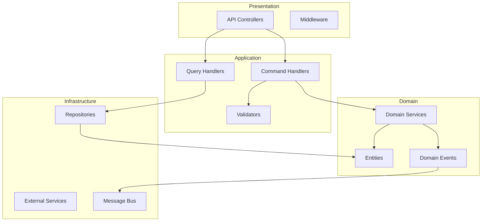

# 시스템 아키텍처 설계서 역설계 가이드

## 목적

코드베이스에서 전체 시스템 구조, 컴포넌트 관계, 기술 스택을 분석하여 아키텍처 문서를 작성합니다.

## 아키텍처 분석 영역

```
┌─────────────────────────────────────────────────────────────────────┐
│                       아키텍처 분석 영역                              │
├─────────────────────────────────────────────────────────────────────┤
│                                                                     │
│  ┌──────────────┐  ┌──────────────┐  ┌──────────────┐              │
│  │  레이어 구조  │  │  모듈 구조   │  │  배포 구조   │              │
│  │              │  │              │  │              │              │
│  │ Presentation │  │   Module A   │  │  Container   │              │
│  │      ↓       │  │      ↕       │  │      ↕       │              │
│  │  Application │  │   Module B   │  │   Service    │              │
│  │      ↓       │  │      ↕       │  │      ↕       │              │
│  │    Domain    │  │   Module C   │  │   Database   │              │
│  │      ↓       │  │              │  │              │              │
│  │Infrastructure│  │              │  │              │              │
│  └──────────────┘  └──────────────┘  └──────────────┘              │
│                                                                     │
└─────────────────────────────────────────────────────────────────────┘
```

## 분석 순서

### 1. 프로젝트 구조 파악

```bash
# 전체 구조 확인
tree -L 3 -I "node_modules|bin|obj|.git|dist|build"

# 프로젝트/솔루션 파일 확인
find . -name "*.sln" -o -name "*.csproj" -o -name "package.json" -o -name "pom.xml"
```

### 2. 기술 스택 식별

| 분석 대상 | 확인 파일 | 추출 정보 |
|----------|----------|----------|
| 언어/런타임 | `*.csproj`, `package.json` | 언어 버전, 런타임 |
| 프레임워크 | `Program.cs`, `Startup.cs` | 웹 프레임워크 |
| 데이터베이스 | `appsettings.json`, 연결문자열 | DB 유형 |
| 메시징 | 설정 파일, 의존성 | 메시지 브로커 |
| 캐싱 | Redis/Memory 설정 | 캐시 전략 |
| 인프라 | `Dockerfile`, `docker-compose.yml` | 컨테이너화 |

### 3. 아키텍처 패턴 식별

| 패턴 | 식별 방법 |
|-----|----------|
| Clean Architecture | `Domain/`, `Application/`, `Infrastructure/` 폴더 구조 |
| Vertical Slice | 기능별 폴더 (`Features/`), 핸들러 패턴 |
| Modular Monolith | 독립적 모듈 폴더, 모듈 간 인터페이스 |
| Microservices | 독립 프로젝트, API Gateway, 서비스 디스커버리 |
| CQRS | Command/Query 분리, 별도 핸들러 |
| Event Sourcing | 이벤트 스토어, 이벤트 핸들러 |

```bash
# Clean Architecture 확인
ls -la src/ 2>/dev/null || ls -la

# Vertical Slice 확인
find . -type d -name "Features" -o -name "Handlers"

# CQRS 확인
find . -name "*Command*.cs" -o -name "*Query*.cs" | head -10
```

## 문서 템플릿

```markdown
# 시스템 아키텍처 설계서

## 1. 문서 정보
| 항목 | 내용 |
|-----|------|
| 프로젝트명 | [프로젝트명] |
| 버전 | [버전] |
| 작성일 | [날짜] |
| 아키텍처 패턴 | [패턴명] |

## 2. 시스템 개요

### 2.1 목적
[시스템의 목적과 범위]

### 2.2 주요 특징
- [특징 1]
- [특징 2]

## 3. 기술 스택

### 3.1 기술 스택 요약
| 영역 | 기술 | 버전 | 용도 |
|-----|------|-----|------|
| 언어 | C# | 12 | 주 개발 언어 |
| 프레임워크 | ASP.NET Core | 8.0 | 웹 API |
| ORM | Entity Framework Core | 8.0 | 데이터 접근 |
| 데이터베이스 | PostgreSQL | 15 | 주 데이터 저장소 |
| 캐시 | Redis | 7.0 | 분산 캐시 |
| 메시징 | RabbitMQ | 3.12 | 비동기 메시징 |
| 컨테이너 | Docker | 24.x | 컨테이너화 |
| 오케스트레이션 | Kubernetes | 1.28 | 컨테이너 관리 |

### 3.2 의존성 패키지
[주요 NuGet/npm 패키지 목록]

## 4. 아키텍처 구조

### 4.1 고수준 아키텍처
```
┌─────────────────────────────────────────────────────────────┐
│                         Clients                              │
│            (Web App, Mobile App, Third-party)               │
└────────────────────────┬────────────────────────────────────┘
                         │
                         ▼
┌─────────────────────────────────────────────────────────────┐
│                      API Gateway                             │
│                 (인증, 라우팅, Rate Limiting)                 │
└────────────────────────┬────────────────────────────────────┘
                         │
        ┌────────────────┼────────────────┐
        ▼                ▼                ▼
┌───────────────┐ ┌───────────────┐ ┌───────────────┐
│  User Service │ │ Order Service │ │Product Service│
└───────┬───────┘ └───────┬───────┘ └───────┬───────┘
        │                 │                 │
        ▼                 ▼                 ▼
┌───────────────┐ ┌───────────────┐ ┌───────────────┐
│   User DB     │ │   Order DB    │ │  Product DB   │
└───────────────┘ └───────────────┘ └───────────────┘
```

### 4.2 레이어 구조
```
┌─────────────────────────────────────────────────────────────┐
│                    Presentation Layer                        │
│              (Controllers, ViewModels, DTOs)                │
├─────────────────────────────────────────────────────────────┤
│                    Application Layer                         │
│            (Use Cases, Commands, Queries, Handlers)         │
├─────────────────────────────────────────────────────────────┤
│                      Domain Layer                            │
│          (Entities, Value Objects, Domain Services)         │
├─────────────────────────────────────────────────────────────┤
│                   Infrastructure Layer                       │
│         (Repositories, External Services, Persistence)      │
└─────────────────────────────────────────────────────────────┘
```

### 4.3 프로젝트 구조
```
src/
├── API/                          # Presentation Layer
│   ├── Controllers/
│   ├── Middleware/
│   └── Filters/
├── Application/                  # Application Layer
│   ├── Commands/
│   ├── Queries/
│   ├── Handlers/
│   └── Validators/
├── Domain/                       # Domain Layer
│   ├── Entities/
│   ├── ValueObjects/
│   ├── Events/
│   └── Services/
└── Infrastructure/               # Infrastructure Layer
    ├── Persistence/
    ├── Services/
    └── Configuration/
```

## 5. 컴포넌트 설계

### 5.1 컴포넌트 다이어그램


### 5.2 주요 컴포넌트
| 컴포넌트 | 책임 | 위치 |
|---------|-----|------|
| UserController | 사용자 API 엔드포인트 | `API/Controllers/` |
| CreateUserHandler | 사용자 생성 로직 | `Application/Handlers/` |
| User | 사용자 도메인 엔티티 | `Domain/Entities/` |
| UserRepository | 사용자 데이터 접근 | `Infrastructure/Persistence/` |

## 6. 통신 패턴

### 6.1 동기 통신
| 구간 | 프로토콜 | 형식 |
|-----|---------|------|
| Client → API | HTTPS | REST/JSON |
| Service → Service | HTTP | REST/JSON |
| Service → DB | TCP | SQL |

### 6.2 비동기 통신
| 구간 | 브로커 | 패턴 |
|-----|--------|-----|
| Service → Service | RabbitMQ | Pub/Sub |
| Event Sourcing | Kafka | Event Log |

## 7. 배포 아키텍처

### 7.1 배포 다이어그램
```
┌─────────────────────────────────────────────────────────────┐
│                     Kubernetes Cluster                       │
├─────────────────────────────────────────────────────────────┤
│  ┌─────────────┐  ┌─────────────┐  ┌─────────────┐         │
│  │   Ingress   │  │   Service   │  │   Service   │         │
│  │  Controller │  │   (API)     │  │   (Worker)  │         │
│  └──────┬──────┘  └──────┬──────┘  └──────┬──────┘         │
│         │                │                │                │
│  ┌──────┴──────┐  ┌──────┴──────┐  ┌──────┴──────┐         │
│  │    Pods     │  │    Pods     │  │    Pods     │         │
│  │  (Replicas) │  │  (Replicas) │  │  (Replicas) │         │
│  └─────────────┘  └─────────────┘  └─────────────┘         │
│                                                             │
│  ┌─────────────────────────────────────────────────────┐   │
│  │                   Persistent Storage                 │   │
│  │         (PostgreSQL, Redis, RabbitMQ)               │   │
│  └─────────────────────────────────────────────────────┘   │
└─────────────────────────────────────────────────────────────┘
```

### 7.2 환경 구성
| 환경 | 용도 | 특징 |
|-----|------|------|
| Development | 개발 | 로컬 Docker |
| Staging | 테스트 | K8s (1 replica) |
| Production | 운영 | K8s (3+ replicas) |

## 8. 보안 아키텍처

### 8.1 인증/인가
| 항목 | 방식 |
|-----|------|
| 인증 | JWT Bearer Token |
| 인가 | Role-based (RBAC) |
| API 키 | 외부 서비스 연동 |

### 8.2 데이터 보안
| 항목 | 방식 |
|-----|------|
| 전송 암호화 | TLS 1.3 |
| 저장 암호화 | AES-256 |
| 비밀번호 | bcrypt |

## 9. 품질 속성

### 9.1 성능
| 지표 | 목표 | 구현 방식 |
|-----|------|----------|
| 응답 시간 | < 200ms | 캐싱, 비동기 처리 |
| 처리량 | 1000 RPS | 수평 확장 |

### 9.2 가용성
| 지표 | 목표 | 구현 방식 |
|-----|------|----------|
| 가용률 | 99.9% | 다중 인스턴스, 헬스체크 |
| 복구 시간 | < 5분 | 자동 재시작, 롤백 |
```

## 분석 명령어 모음

```bash
# 전체 의존성 확인 (.NET)
dotnet list package

# 전체 의존성 확인 (Node.js)
cat package.json | jq '.dependencies, .devDependencies'

# 프로젝트 참조 관계 확인
grep -rn "ProjectReference" --include="*.csproj"

# 서비스 등록 확인 (DI)
grep -rn "services.Add\|builder.Services" --include="*.cs"

# 미들웨어 파이프라인 확인
grep -rn "app.Use\|app.Map" --include="*.cs"
```
