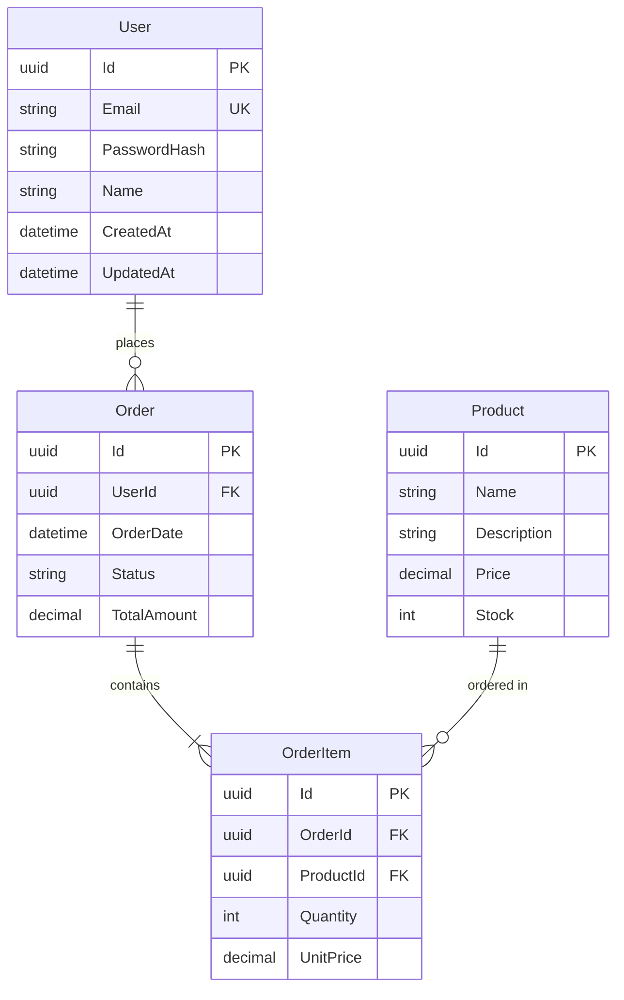

# 데이터베이스 설계서 역설계 가이드

## 목적

코드베이스에서 데이터 모델, 스키마 정의, 관계를 분석하여 데이터베이스 설계 문서를 작성합니다.

## 분석 소스

```
┌─────────────────────────────────────────────────────────────────┐
│                    데이터베이스 설계 추출 소스                     │
├─────────────────────────────────────────────────────────────────┤
│                                                                 │
│  ┌─────────────────┐  ┌─────────────────┐  ┌─────────────────┐ │
│  │   Entity 클래스  │  │   Migration     │  │   설정 파일     │ │
│  │                 │  │   파일          │  │                 │ │
│  │  - 속성 정의    │  │  - 테이블 생성  │  │  - DB 연결     │ │
│  │  - 관계 설정    │  │  - 인덱스 정의  │  │  - 스키마 정보 │ │
│  │  - 제약조건     │  │  - 시드 데이터  │  │                 │ │
│  └────────┬────────┘  └────────┬────────┘  └────────┬────────┘ │
│           │                    │                    │          │
│           └────────────────────┼────────────────────┘          │
│                               ↓                                │
│                    ┌─────────────────────┐                     │
│                    │  데이터베이스 설계서  │                     │
│                    └─────────────────────┘                     │
│                                                                 │
└─────────────────────────────────────────────────────────────────┘
```

## 분석 방법

### 1. Entity 클래스 분석 (ORM)

#### Entity Framework Core
```bash
# Entity 클래스 찾기
find . -name "*.cs" -path "*Entities*" -o -name "*.cs" -path "*Models*" | xargs grep -l "public.*Id"

# 관계 설정 확인
grep -rn "HasMany\|HasOne\|BelongsTo\|WithMany\|WithOne" --include="*.cs"

# 데이터 어노테이션 확인
grep -rn "\[Table\]\|\[Column\]\|\[Key\]\|\[ForeignKey\]\|\[Index\]" --include="*.cs"
```

#### TypeORM / Prisma
```bash
# TypeORM Entity
grep -rn "@Entity\|@Column\|@PrimaryGeneratedColumn" --include="*.ts"

# Prisma Schema
cat prisma/schema.prisma 2>/dev/null
```

### 2. Migration 파일 분석

```bash
# EF Core Migrations
find . -path "*Migrations*" -name "*.cs" | head -10

# 테이블 생성 확인
grep -rn "CreateTable\|AddColumn\|CreateIndex" --include="*.cs"
```

### 3. DbContext 분석

```bash
# DbSet 정의 확인
grep -rn "DbSet<\|IDbSet<" --include="*.cs"

# Fluent API 설정 확인
grep -rn "OnModelCreating\|modelBuilder\." --include="*.cs"
```

## 문서 템플릿

```markdown
# 데이터베이스 설계서

## 1. 문서 정보
| 항목 | 내용 |
|-----|------|
| 프로젝트명 | [프로젝트명] |
| 버전 | [버전] |
| 작성일 | [날짜] |
| DBMS | [PostgreSQL/MySQL/SQL Server] |
| ORM | [Entity Framework Core/TypeORM/Prisma] |

## 2. 데이터베이스 개요

### 2.1 데이터베이스 구성
| 항목 | 설정값 |
|-----|-------|
| 데이터베이스명 | [DB명] |
| 기본 스키마 | [스키마명] |
| 문자셋 | UTF-8 |
| Collation | [Collation] |

### 2.2 연결 정보 (환경별)
| 환경 | 호스트 | 포트 | 비고 |
|-----|-------|-----|------|
| Development | localhost | 5432 | Docker |
| Staging | staging-db.example.com | 5432 | AWS RDS |
| Production | prod-db.example.com | 5432 | AWS RDS (Multi-AZ) |

## 3. ERD (Entity Relationship Diagram)

### 3.1 전체 ERD
```
┌─────────────────────────────────────────────────────────────────┐
│                         ERD 개요                                 │
├─────────────────────────────────────────────────────────────────┤
│                                                                 │
│  ┌─────────────┐       ┌─────────────┐       ┌─────────────┐   │
│  │    User     │       │    Order    │       │   Product   │   │
│  ├─────────────┤       ├─────────────┤       ├─────────────┤   │
│  │ PK: Id      │       │ PK: Id      │       │ PK: Id      │   │
│  │ Email       │──1:N──│ FK: UserId  │       │ Name        │   │
│  │ Name        │       │ OrderDate   │──N:M──│ Price       │   │
│  │ CreatedAt   │       │ Status      │       │ Stock       │   │
│  └─────────────┘       └─────────────┘       └─────────────┘   │
│         │                     │                                │
│         │              ┌──────┴──────┐                        │
│         │              │ OrderItem   │                        │
│         │              ├─────────────┤                        │
│         │              │ PK: Id      │                        │
│         │              │ FK: OrderId │                        │
│         └─────────────>│ FK: ProductId│                        │
│                        │ Quantity    │                        │
│                        │ UnitPrice   │                        │
│                        └─────────────┘                        │
│                                                                 │
└─────────────────────────────────────────────────────────────────┘
```

### 3.2 Mermaid ERD


## 4. 테이블 정의

### 4.1 테이블 목록
| 테이블명 | 설명 | 주요 관계 | Entity 클래스 |
|---------|------|----------|--------------|
| Users | 사용자 정보 | 1:N → Orders | `User.cs` |
| Orders | 주문 정보 | N:1 → Users, 1:N → OrderItems | `Order.cs` |
| Products | 상품 정보 | 1:N → OrderItems | `Product.cs` |
| OrderItems | 주문 상세 | N:1 → Orders, N:1 → Products | `OrderItem.cs` |

---

### 4.2 테이블 상세: Users

#### 기본 정보
| 항목 | 내용 |
|-----|------|
| 테이블명 | Users |
| 스키마 | public |
| 설명 | 사용자 계정 정보 |
| Entity | `Domain/Entities/User.cs` |

#### 컬럼 정의
| 컬럼명 | 데이터 타입 | NULL | 기본값 | 설명 |
|-------|-----------|------|-------|------|
| Id | uuid | NOT NULL | gen_random_uuid() | PK |
| Email | varchar(255) | NOT NULL | - | 이메일 (UK) |
| PasswordHash | varchar(500) | NOT NULL | - | 해시된 비밀번호 |
| Name | varchar(100) | NOT NULL | - | 사용자 이름 |
| PhoneNumber | varchar(20) | NULL | - | 전화번호 |
| IsActive | boolean | NOT NULL | true | 활성 상태 |
| EmailVerifiedAt | timestamptz | NULL | - | 이메일 인증 시각 |
| CreatedAt | timestamptz | NOT NULL | now() | 생성 시각 |
| UpdatedAt | timestamptz | NOT NULL | now() | 수정 시각 |
| DeletedAt | timestamptz | NULL | - | 삭제 시각 (Soft Delete) |

#### 인덱스
| 인덱스명 | 컬럼 | 유형 | 설명 |
|---------|-----|------|------|
| PK_Users | Id | PRIMARY | 기본키 |
| IX_Users_Email | Email | UNIQUE | 이메일 유니크 |
| IX_Users_CreatedAt | CreatedAt | INDEX | 생성일 조회용 |

#### 제약조건
| 제약조건명 | 유형 | 컬럼 | 설명 |
|-----------|-----|------|------|
| PK_Users | PRIMARY KEY | Id | 기본키 |
| UQ_Users_Email | UNIQUE | Email | 이메일 유일성 |
| CK_Users_Email | CHECK | Email | 이메일 형식 검증 |

#### 관계
| 관계 | 대상 테이블 | 타입 | FK 컬럼 |
|-----|-----------|------|--------|
| Orders | Orders | 1:N | Orders.UserId |

---

## 5. 관계 정의

### 5.1 관계 목록
| 관계명 | 부모 테이블 | 자식 테이블 | 타입 | 삭제 동작 |
|-------|-----------|-----------|------|----------|
| FK_Orders_Users | Users | Orders | 1:N | RESTRICT |
| FK_OrderItems_Orders | Orders | OrderItems | 1:N | CASCADE |
| FK_OrderItems_Products | Products | OrderItems | 1:N | RESTRICT |

### 5.2 Cardinality 요약
```
Users      1 ──────────< * Orders
Orders     1 ──────────< * OrderItems
Products   1 ──────────< * OrderItems
```

## 6. 인덱스 전략

### 6.1 인덱스 목록
| 테이블 | 인덱스명 | 컬럼 | 유형 | 용도 |
|-------|---------|-----|------|------|
| Users | IX_Users_Email | Email | Unique | 로그인 조회 |
| Orders | IX_Orders_UserId | UserId | Index | 사용자별 주문 조회 |
| Orders | IX_Orders_Status_Date | Status, OrderDate | Composite | 상태별 주문 검색 |
| Products | IX_Products_Name | Name | Index | 상품명 검색 |

### 6.2 인덱스 설계 원칙
| 원칙 | 설명 |
|-----|------|
| FK 인덱스 | 모든 FK 컬럼에 인덱스 생성 |
| 검색 조건 | WHERE 절에 자주 사용되는 컬럼 |
| 정렬 조건 | ORDER BY에 사용되는 컬럼 |
| 커버링 인덱스 | 자주 함께 조회되는 컬럼 그룹 |

## 7. 데이터 무결성

### 7.1 무결성 규칙
| 규칙 | 구현 방식 | 대상 |
|-----|----------|------|
| 참조 무결성 | Foreign Key | 모든 FK |
| 도메인 무결성 | Check Constraint | 상태값, 금액 |
| 유일성 | Unique Index | Email, 주문번호 |
| Soft Delete | DeletedAt 컬럼 | Users, Orders |

### 7.2 Cascade 규칙
| 부모 테이블 | 자식 테이블 | ON DELETE | ON UPDATE |
|-----------|-----------|----------|----------|
| Users | Orders | RESTRICT | CASCADE |
| Orders | OrderItems | CASCADE | CASCADE |
| Products | OrderItems | RESTRICT | CASCADE |

## 8. 시드 데이터

### 8.1 기본 데이터
| 테이블 | 설명 | 데이터 수 |
|-------|------|----------|
| Roles | 역할 마스터 | 3건 (Admin, User, Guest) |
| OrderStatuses | 주문 상태 마스터 | 5건 |
| Categories | 카테고리 마스터 | N건 |

### 8.2 시드 SQL 예시
```sql
-- Roles 시드 데이터
INSERT INTO Roles (Id, Name, Description)
VALUES 
  ('admin', 'Admin', '관리자'),
  ('user', 'User', '일반 사용자'),
  ('guest', 'Guest', '게스트');
```

## 9. 마이그레이션 이력

| 버전 | 마이그레이션명 | 설명 | 적용일 |
|-----|--------------|------|-------|
| 001 | InitialCreate | 초기 스키마 생성 | 2024-01-01 |
| 002 | AddUserPhoneNumber | 전화번호 컬럼 추가 | 2024-01-15 |
| 003 | AddOrderIndex | 주문 인덱스 추가 | 2024-02-01 |
```

## 데이터 타입 매핑

### C# → PostgreSQL
| C# 타입 | PostgreSQL 타입 | 비고 |
|--------|----------------|------|
| Guid | uuid | PK 권장 |
| string | varchar(n) / text | 길이 제한 시 varchar |
| int | integer | - |
| long | bigint | - |
| decimal | numeric(p,s) | 금액 |
| bool | boolean | - |
| DateTime | timestamptz | UTC 저장 |
| DateOnly | date | .NET 6+ |
| TimeOnly | time | .NET 6+ |

### C# → SQL Server
| C# 타입 | SQL Server 타입 | 비고 |
|--------|----------------|------|
| Guid | uniqueidentifier | PK |
| string | nvarchar(n) / nvarchar(max) | Unicode |
| int | int | - |
| long | bigint | - |
| decimal | decimal(p,s) | 금액 |
| bool | bit | - |
| DateTime | datetime2 | - |
| DateTimeOffset | datetimeoffset | 시간대 포함 |

## 분석 명령어 모음

```bash
# Entity 속성 추출
grep -rn "public.*{.*get" --include="*.cs" -A 2 | grep -E "^\s+public"

# FK 관계 추출
grep -rn "ForeignKey\|HasForeignKey\|References" --include="*.cs"

# 인덱스 설정 추출
grep -rn "HasIndex\|Index\|CreateIndex" --include="*.cs"

# DbContext 테이블 매핑
grep -rn "ToTable\|modelBuilder.Entity" --include="*.cs"
```
