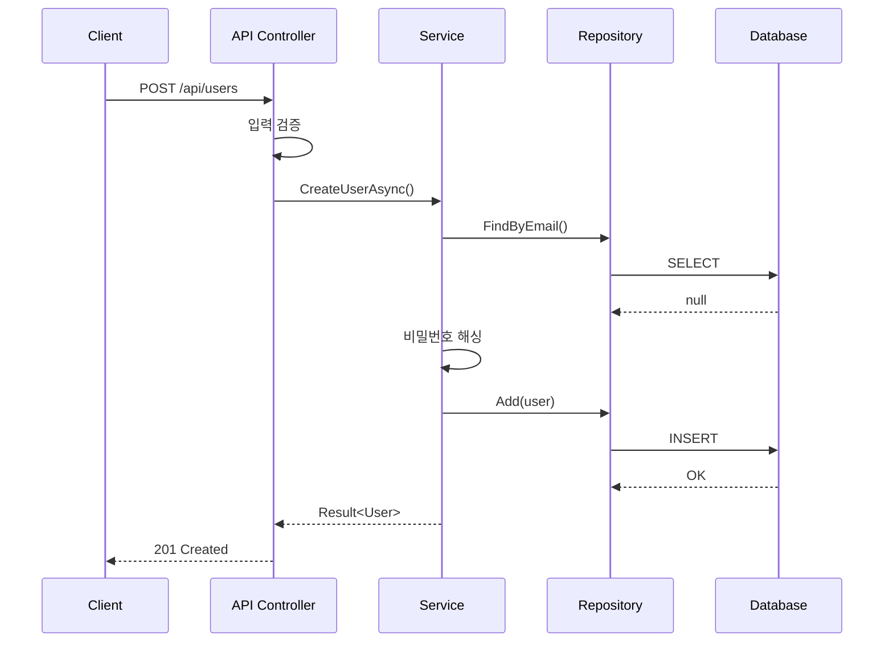

# 기능 명세서 역설계 가이드

## 목적

코드베이스에서 각 기능의 상세 동작, 입출력, 처리 로직을 추출합니다.

## 분석 흐름

```
┌──────────────────────────────────────────────────────────────────┐
│                      기능 명세 추출 프로세스                        │
├──────────────────────────────────────────────────────────────────┤
│                                                                  │
│   Controller/API          Service Layer         Domain Layer     │
│   ┌─────────────┐        ┌─────────────┐       ┌─────────────┐  │
│   │ 엔드포인트   │   →    │ 비즈니스    │   →   │ 엔티티      │  │
│   │ 입력 검증   │        │ 로직        │       │ 비즈니스    │  │
│   │ 응답 형식   │        │ 트랜잭션    │       │ 규칙        │  │
│   └─────────────┘        └─────────────┘       └─────────────┘  │
│         ↓                      ↓                     ↓          │
│   ┌─────────────────────────────────────────────────────────┐   │
│   │                    기능 명세서 생성                       │   │
│   └─────────────────────────────────────────────────────────┘   │
│                                                                  │
└──────────────────────────────────────────────────────────────────┘
```

## 분석 대상 코드 패턴

### 1. API 엔드포인트 분석

```csharp
// 추출 대상 정보
[HttpPost("users")]                    // → HTTP 메서드, 경로
[Authorize(Roles = "Admin")]           // → 권한 요구사항
public async Task<ActionResult<UserDto>> CreateUser(
    [FromBody] CreateUserRequest request)  // → 입력 파라미터
{
    // 비즈니스 로직 호출            // → 처리 흐름
    return Ok(result);              // → 응답 형식
}
```

### 2. 서비스 메서드 분석

```csharp
// 추출 대상 정보
public async Task<Result<User>> CreateUserAsync(
    CreateUserCommand command)      // → 명령/쿼리 객체
{
    // 유효성 검사                  // → 사전 조건
    // 비즈니스 규칙 적용           // → 처리 로직
    // 이벤트 발행                  // → 부수 효과
    return Result.Success(user);    // → 반환 값
}
```

## 문서 템플릿

```markdown
# 기능 명세서

## 1. 문서 정보
| 항목 | 내용 |
|-----|------|
| 프로젝트명 | [프로젝트명] |
| 버전 | [버전] |
| 작성일 | [날짜] |

## 2. 기능 목록

### 2.1 기능 분류 체계
| 대분류 | 중분류 | 기능 ID | 기능명 |
|-------|-------|---------|-------|
| 사용자 관리 | 계정 | FN-USR-001 | 회원가입 |
| 사용자 관리 | 인증 | FN-USR-002 | 로그인 |

---

## 3. 기능 상세

### FN-USR-001: 회원가입

#### 기본 정보
| 항목 | 내용 |
|-----|------|
| 기능 ID | FN-USR-001 |
| 기능명 | 회원가입 |
| 관련 요구사항 | FR-001 |
| 구현 위치 | `UserController.Register()` |

#### API 정보
| 항목 | 내용 |
|-----|------|
| HTTP 메서드 | POST |
| 경로 | `/api/users/register` |
| 인증 | 불필요 |
| 권한 | 없음 |

#### 입력 파라미터
| 파라미터 | 타입 | 필수 | 설명 | 검증 규칙 |
|---------|------|-----|------|----------|
| email | string | Y | 이메일 주소 | 이메일 형식 |
| password | string | Y | 비밀번호 | 최소 8자, 특수문자 포함 |
| name | string | Y | 사용자 이름 | 2-50자 |

#### 출력 응답
**성공 (201 Created)**
```json
{
  "id": "uuid",
  "email": "user@example.com",
  "name": "홍길동",
  "createdAt": "2024-01-15T10:30:00Z"
}
```

**실패 응답**
| 상태 코드 | 에러 코드 | 설명 |
|----------|----------|------|
| 400 | INVALID_EMAIL | 이메일 형식 오류 |
| 409 | EMAIL_EXISTS | 이메일 중복 |

#### 처리 흐름
```
1. 입력 데이터 검증
   └─ 실패 시: 400 Bad Request 반환
2. 이메일 중복 확인
   └─ 중복 시: 409 Conflict 반환
3. 비밀번호 해싱
4. 사용자 엔티티 생성
5. 데이터베이스 저장
6. 환영 이메일 발송 (비동기)
7. 응답 반환
```

#### 비즈니스 규칙
| 규칙 ID | 설명 |
|--------|------|
| BR-001 | 이메일은 시스템 내 고유해야 함 |
| BR-002 | 비밀번호는 bcrypt로 해싱 |

#### 연관 기능
- FN-USR-002: 로그인 (후속 기능)
- FN-USR-003: 이메일 인증 (연계 기능)
```

## 기능 ID 명명 규칙

```
FN-[모듈]-[번호]

예시:
FN-USR-001  : 사용자 모듈 기능 1번
FN-ORD-001  : 주문 모듈 기능 1번
FN-PAY-001  : 결제 모듈 기능 1번
FN-RPT-001  : 리포트 모듈 기능 1번
```

## 분석 명령어

### .NET 프로젝트
```bash
# Controller 메서드 목록 추출
grep -rn "public.*async.*Task\|public.*ActionResult\|public.*IActionResult" \
  --include="*Controller.cs"

# DTO/Request 모델 분석
find . -name "*Dto.cs" -o -name "*Request.cs" -o -name "*Response.cs"

# 유효성 검증 규칙 추출
grep -rn "\[Required\]\|\[MaxLength\]\|\[EmailAddress\]" --include="*.cs"
```

### Node.js/TypeScript 프로젝트
```bash
# 라우트 핸들러 추출
grep -rn "router\.\(get\|post\|put\|delete\)" --include="*.ts"

# Joi/Zod 스키마 분석
grep -rn "Joi\.\|z\." --include="*.ts" | head -30
```

## 처리 흐름 다이어그램 예시


