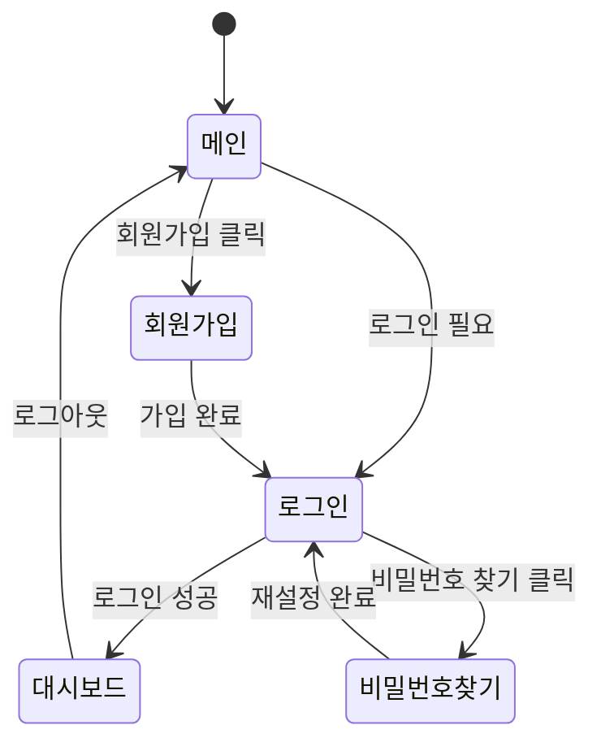
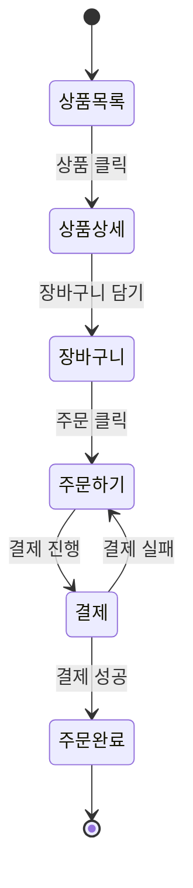

# UI/화면 설계서 역설계 가이드

## 목적

코드베이스에서 사용자 인터페이스 구성, 화면 흐름, 컴포넌트 구조를 분석하여 UI 설계 문서를 작성합니다.

## 적용 범위

```
┌─────────────────────────────────────────────────────────────────┐
│                       UI 분석 대상                               │
├─────────────────────────────────────────────────────────────────┤
│                                                                 │
│  Frontend 프로젝트                Backend API 프로젝트           │
│  ┌───────────────────┐          ┌───────────────────┐          │
│  │ 컴포넌트 구조      │          │ API 엔드포인트     │          │
│  │ 라우팅 설정       │          │ DTO/Response 모델  │          │
│  │ 상태 관리        │          │ Swagger/OpenAPI    │          │
│  │ 스타일 시스템     │          │ 에러 응답 형식     │          │
│  └───────────────────┘          └───────────────────┘          │
│           │                              │                      │
│           └──────────────┬───────────────┘                      │
│                          ↓                                      │
│                  ┌───────────────┐                              │
│                  │ UI 설계서 생성 │                              │
│                  └───────────────┘                              │
│                                                                 │
└─────────────────────────────────────────────────────────────────┘
```

## Frontend 프로젝트 분석

### 1. 라우팅 구조 분석

```bash
# React Router 분석
grep -rn "Route\|path=" --include="*.tsx" --include="*.jsx" | head -30

# Next.js 페이지 구조
find . -path "*/pages/*" -name "*.tsx" -o -path "*/app/*" -name "page.tsx"

# Vue Router 분석
grep -rn "routes\|path:" --include="*.ts" --include="*.vue" | head -30

# Angular 라우팅
grep -rn "RouterModule\|path:" --include="*.ts" | head -30
```

### 2. 컴포넌트 구조 분석

```bash
# React 컴포넌트 목록
find . -name "*.tsx" -o -name "*.jsx" | grep -i "component\|page\|view"

# Vue 컴포넌트 목록
find . -name "*.vue"

# 컴포넌트 import 관계
grep -rn "import.*from" --include="*.tsx" | grep -i "component" | head -20
```

### 3. 상태 관리 분석

| 상태 관리 | 분석 대상 |
|----------|----------|
| Redux | `store/`, `reducer`, `action`, `slice` |
| Zustand | `create()`, `useStore` |
| Recoil | `atom`, `selector`, `useRecoilState` |
| MobX | `@observable`, `@action`, `makeAutoObservable` |
| Pinia | `defineStore`, `useStore` |

## Backend API에서 UI 추론

### 1. API 엔드포인트 → 화면 매핑

```csharp
// API 구조에서 화면 추론
[Route("api/users")]
public class UserController
{
    [HttpGet]           // → 사용자 목록 화면
    [HttpGet("{id}")]   // → 사용자 상세 화면
    [HttpPost]          // → 사용자 등록 화면
    [HttpPut("{id}")]   // → 사용자 수정 화면
    [HttpDelete("{id}")] // → 삭제 확인 모달
}
```

### 2. DTO/Response에서 필드 추출

```bash
# DTO 클래스에서 화면 필드 추출
grep -rn "public.*{.*get" --include="*Dto.cs" --include="*Response.cs"

# 유효성 검증 규칙 추출 (입력 폼 구성에 활용)
grep -rn "\[Required\]\|\[MaxLength\]\|\[EmailAddress\]" --include="*.cs"
```

## 문서 템플릿

```markdown
# UI/화면 설계서

## 1. 문서 정보
| 항목 | 내용 |
|-----|------|
| 프로젝트명 | [프로젝트명] |
| 버전 | [버전] |
| 작성일 | [날짜] |
| UI 프레임워크 | [React/Vue/Angular/없음] |

## 2. 화면 목록

### 2.1 화면 구조도
```
┌─────────────────────────────────────────────────────────────┐
│                        시스템 화면 구조                       │
├─────────────────────────────────────────────────────────────┤
│                                                             │
│  ┌─────────────┐                                           │
│  │   메인 홈   │                                           │
│  └──────┬──────┘                                           │
│         │                                                   │
│    ┌────┴────┬────────────┬────────────┐                   │
│    ▼         ▼            ▼            ▼                   │
│ ┌──────┐ ┌──────┐   ┌──────────┐  ┌──────────┐           │
│ │로그인 │ │회원가입│   │상품 목록  │  │마이페이지 │           │
│ └──────┘ └──────┘   └────┬─────┘  └────┬─────┘           │
│                          │             │                   │
│                     ┌────┴────┐   ┌────┴────┐             │
│                     ▼         ▼   ▼         ▼             │
│                 ┌──────┐ ┌──────┐ ┌────┐ ┌──────┐        │
│                 │상품  │ │장바구니│ │주문│ │프로필 │        │
│                 │상세  │ │      │ │내역│ │수정  │        │
│                 └──────┘ └──────┘ └────┘ └──────┘        │
│                                                             │
└─────────────────────────────────────────────────────────────┘
```

### 2.2 화면 목록
| 화면 ID | 화면명 | URL | 인증 | 관련 API |
|--------|-------|-----|-----|---------|
| SCR-001 | 로그인 | /login | 불필요 | POST /api/auth/login |
| SCR-002 | 회원가입 | /register | 불필요 | POST /api/users |
| SCR-003 | 대시보드 | /dashboard | 필요 | GET /api/dashboard |
| SCR-004 | 상품 목록 | /products | 선택 | GET /api/products |
| SCR-005 | 상품 상세 | /products/:id | 선택 | GET /api/products/:id |

---

## 3. 화면 상세

### SCR-001: 로그인 화면

#### 기본 정보
| 항목 | 내용 |
|-----|------|
| 화면 ID | SCR-001 |
| 화면명 | 로그인 |
| URL | /login |
| 인증 | 불필요 |
| 관련 유스케이스 | UC-002 |

#### 화면 레이아웃
```
┌─────────────────────────────────────────────────────────────┐
│  [Logo]                                        [회원가입]   │
├─────────────────────────────────────────────────────────────┤
│                                                             │
│                    ┌─────────────────────┐                 │
│                    │                     │                 │
│                    │      로그인         │                 │
│                    │                     │                 │
│                    │  ┌───────────────┐  │                 │
│                    │  │ 이메일        │  │                 │
│                    │  └───────────────┘  │                 │
│                    │                     │                 │
│                    │  ┌───────────────┐  │                 │
│                    │  │ 비밀번호      │  │                 │
│                    │  └───────────────┘  │                 │
│                    │                     │                 │
│                    │  □ 로그인 상태 유지  │                 │
│                    │                     │                 │
│                    │  [  로그인  ]       │                 │
│                    │                     │                 │
│                    │  비밀번호 찾기      │                 │
│                    │                     │                 │
│                    │  ─────────────────  │                 │
│                    │  소셜 로그인        │                 │
│                    │  [G] [K] [N]        │                 │
│                    │                     │                 │
│                    └─────────────────────┘                 │
│                                                             │
└─────────────────────────────────────────────────────────────┘
```

#### 화면 요소
| 요소 ID | 요소명 | 타입 | 필수 | 검증 규칙 |
|--------|-------|------|-----|----------|
| email | 이메일 | text input | Y | 이메일 형식 |
| password | 비밀번호 | password input | Y | 최소 1자 |
| rememberMe | 로그인 상태 유지 | checkbox | N | - |
| btnLogin | 로그인 버튼 | button | - | - |
| lnkForgot | 비밀번호 찾기 | link | - | - |
| btnGoogle | Google 로그인 | button | - | - |
| btnKakao | Kakao 로그인 | button | - | - |
| btnNaver | Naver 로그인 | button | - | - |

#### 이벤트 처리
| 이벤트 | 트리거 | 동작 |
|-------|-------|------|
| onSubmit | 로그인 버튼 클릭 | POST /api/auth/login 호출 |
| onSuccess | 로그인 성공 | 대시보드로 리다이렉트 |
| onError | 로그인 실패 | 오류 메시지 표시 |
| onSocialLogin | 소셜 로그인 클릭 | OAuth 인증 페이지 리다이렉트 |

#### 상태 관리
| 상태 | 타입 | 설명 |
|-----|------|------|
| email | string | 입력된 이메일 |
| password | string | 입력된 비밀번호 |
| rememberMe | boolean | 로그인 유지 여부 |
| isLoading | boolean | 로그인 진행 중 |
| error | string | 오류 메시지 |

#### 유효성 검증
| 필드 | 검증 규칙 | 오류 메시지 |
|-----|----------|-----------|
| email | required, email format | "이메일을 입력해주세요" |
| password | required | "비밀번호를 입력해주세요" |

---

## 4. 공통 컴포넌트

### 4.1 컴포넌트 목록
| 컴포넌트 ID | 컴포넌트명 | 용도 | 위치 |
|------------|----------|------|------|
| CMP-001 | Header | 상단 네비게이션 | `components/Header` |
| CMP-002 | Footer | 하단 정보 | `components/Footer` |
| CMP-003 | Button | 공통 버튼 | `components/ui/Button` |
| CMP-004 | Input | 공통 입력 필드 | `components/ui/Input` |
| CMP-005 | Modal | 모달 다이얼로그 | `components/ui/Modal` |
| CMP-006 | Table | 데이터 테이블 | `components/ui/Table` |
| CMP-007 | Pagination | 페이지네이션 | `components/ui/Pagination` |

### 4.2 레이아웃 컴포넌트
```
┌─────────────────────────────────────────────────────────────┐
│                      Header (CMP-001)                        │
├─────────────────────────────────────────────────────────────┤
│  ┌─────────┐  ┌─────────────────────────────────────────┐  │
│  │         │  │                                         │  │
│  │ Sidebar │  │              Main Content               │  │
│  │         │  │                                         │  │
│  │         │  │                                         │  │
│  │         │  │                                         │  │
│  └─────────┘  └─────────────────────────────────────────┘  │
├─────────────────────────────────────────────────────────────┤
│                      Footer (CMP-002)                        │
└─────────────────────────────────────────────────────────────┘
```

## 5. 화면 흐름

### 5.1 인증 흐름


### 5.2 주요 업무 흐름


## 6. 반응형 설계

### 6.1 브레이크포인트
| 이름 | 범위 | 레이아웃 |
|-----|------|---------|
| Mobile | < 768px | 1 컬럼 |
| Tablet | 768px - 1024px | 2 컬럼 |
| Desktop | > 1024px | 3 컬럼 |

### 6.2 반응형 레이아웃 변화
```
Desktop (> 1024px)          Tablet (768-1024px)        Mobile (< 768px)
┌─────┬───────────┐        ┌─────┬─────────┐         ┌─────────────┐
│Side │  Content  │        │Side │ Content │         │   Header    │
│bar  │           │   →    │bar  │         │    →    ├─────────────┤
│     │           │        │     │         │         │   Content   │
│     │           │        │     │         │         │             │
└─────┴───────────┘        └─────┴─────────┘         └─────────────┘
```
```

## 분석 명령어 모음

```bash
# 전체 페이지/화면 목록 (React)
find . -path "*/pages/*" -name "*.tsx" -o -path "*/views/*" -name "*.tsx"

# 라우트 설정 추출
grep -rn "path:\|Route " --include="*.tsx" --include="*.ts"

# API 호출 패턴 분석
grep -rn "fetch\|axios\|useSWR\|useQuery" --include="*.ts" --include="*.tsx" | head -30

# 폼 구성 요소 분석
grep -rn "<input\|<Input\|<Form\|useForm" --include="*.tsx" | head -30
```
