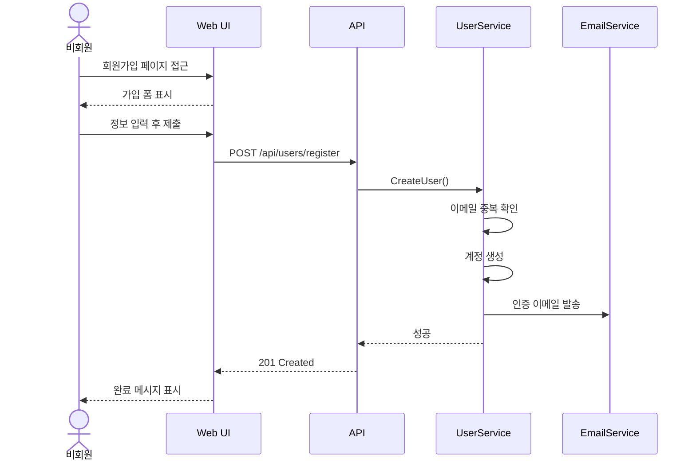

# 유스케이스 시나리오 역설계 가이드

## 목적

코드베이스에서 사용자-시스템 상호작용 흐름을 추출하여 유스케이스 문서를 작성합니다.

## 유스케이스 추출 전략

```
┌─────────────────────────────────────────────────────────────────┐
│                    유스케이스 추출 소스                           │
├─────────────────────────────────────────────────────────────────┤
│                                                                 │
│  ┌─────────────┐    ┌─────────────┐    ┌─────────────┐        │
│  │ Controller  │    │   Service   │    │    Test     │        │
│  │   Actions   │    │   Methods   │    │   Cases     │        │
│  └──────┬──────┘    └──────┬──────┘    └──────┬──────┘        │
│         │                  │                  │               │
│         └────────────┬─────┴──────────────────┘               │
│                      ↓                                        │
│              ┌──────────────┐                                 │
│              │  Actor 식별   │                                 │
│              └──────┬───────┘                                 │
│                     ↓                                         │
│              ┌──────────────┐                                 │
│              │ 시나리오 구성 │                                 │
│              └──────────────┘                                 │
│                                                                │
└─────────────────────────────────────────────────────────────────┘
```

## Actor 식별 방법

### 1. 인증/권한에서 추출

```csharp
// Role 기반 Actor 식별
[Authorize(Roles = "Admin")]      // → Actor: 관리자
[Authorize(Roles = "User")]       // → Actor: 일반 사용자
[AllowAnonymous]                  // → Actor: 비회원/방문자
```

### 2. 분석 명령어

```bash
# .NET Role 추출
grep -rn "Roles\s*=" --include="*.cs" | sort -u

# Policy 추출
grep -rn "Policy\s*=" --include="*.cs" | sort -u

# 테스트에서 사용자 유형 추출
grep -rn "WithRole\|AsUser\|AsAdmin" --include="*Test*.cs"
```

## Actor 목록 템플릿

| Actor ID | Actor명 | 설명 | 인증 방식 | 권한 수준 |
|----------|--------|------|----------|----------|
| ACT-001 | 비회원 | 미인증 사용자 | 없음 | Public |
| ACT-002 | 회원 | 인증된 일반 사용자 | JWT | User |
| ACT-003 | 관리자 | 시스템 관리자 | JWT | Admin |
| ACT-SYS | 시스템 | 자동화/스케줄러 | API Key | System |

## 유스케이스 다이어그램

```
┌─────────────────────────────────────────────────────────────┐
│                        시스템 경계                           │
│  ┌───────────────────────────────────────────────────────┐ │
│  │                                                       │ │
│  │     ┌─────────┐         ┌─────────┐                  │ │
│  │     │ UC-001  │         │ UC-002  │                  │ │
│  │     │ 회원가입 │         │  로그인  │                  │ │
│  │     └────┬────┘         └────┬────┘                  │ │
│  │          │                   │                       │ │
│  │          │   ┌─────────┐     │                       │ │
○──┼──────────┴───┤ UC-003  ├─────┘                       │ │
비회원             │ 상품검색 │                             │ │
│  │              └────┬────┘                             │ │
│  │                   │                                  │ │
│  │          ┌────────┴────────┐                        │ │
○──┼──────────┤     UC-004      │                        │ │
회원 │          │    주문하기     │                        │ │
│  │          └────────┬────────┘                        │ │
│  │                   │                                  │ │
│  │          ┌────────┴────────┐                        │ │
○──┼──────────┤     UC-005      │                        │ │
관리자         │   주문 관리      │                        │ │
│  │          └─────────────────┘                        │ │
│  │                                                       │ │
│  └───────────────────────────────────────────────────────┘ │
└─────────────────────────────────────────────────────────────┘
```

## 문서 템플릿

```markdown
# 유스케이스 명세서

## 1. 문서 정보
| 항목 | 내용 |
|-----|------|
| 프로젝트명 | [프로젝트명] |
| 버전 | [버전] |
| 작성일 | [날짜] |

## 2. Actor 정의

| Actor | 설명 | 권한 |
|-------|------|-----|
| 비회원 | 인증되지 않은 사용자 | 조회 |
| 회원 | 인증된 사용자 | 조회, 주문 |
| 관리자 | 시스템 관리자 | 전체 |

## 3. 유스케이스 목록

| UC ID | 유스케이스명 | Actor | 우선순위 |
|-------|------------|-------|---------|
| UC-001 | 회원가입 | 비회원 | 필수 |
| UC-002 | 로그인 | 비회원/회원 | 필수 |
| UC-003 | 상품 검색 | 모든 사용자 | 필수 |

---

## 4. 유스케이스 상세

### UC-001: 회원가입

#### 기본 정보
| 항목 | 내용 |
|-----|------|
| 유스케이스 ID | UC-001 |
| 유스케이스명 | 회원가입 |
| Actor | 비회원 |
| 목적 | 시스템 계정을 생성하여 서비스 이용 |
| 사전조건 | 유효한 이메일 주소 보유 |
| 사후조건 | 계정 생성, 인증 이메일 발송 |
| 관련 기능 | FN-USR-001 |

#### 기본 흐름 (Main Flow)
| 단계 | Actor | 시스템 |
|-----|-------|-------|
| 1 | 회원가입 페이지 접근 | 회원가입 폼 표시 |
| 2 | 이메일, 비밀번호, 이름 입력 | - |
| 3 | 가입 버튼 클릭 | 입력값 검증 |
| 4 | - | 이메일 중복 확인 |
| 5 | - | 계정 생성 |
| 6 | - | 인증 이메일 발송 |
| 7 | 완료 메시지 확인 | 성공 메시지 표시 |

#### 대안 흐름 (Alternative Flow)
**AF-1: 소셜 로그인으로 가입**
| 단계 | Actor | 시스템 |
|-----|-------|-------|
| 2a | 소셜 로그인 버튼 클릭 | OAuth 인증 페이지 리다이렉트 |
| 2b | 소셜 계정으로 인증 | 토큰 검증 |
| 2c | - | 프로필 정보 조회 |
| → 5 | | 기본 흐름으로 복귀 |

#### 예외 흐름 (Exception Flow)
**EF-1: 이메일 중복**
| 단계 | 시스템 응답 |
|-----|-----------|
| 4a | 중복 이메일 감지 |
| 4b | "이미 등록된 이메일입니다" 오류 표시 |
| 4c | 로그인 페이지 링크 제공 |

**EF-2: 유효성 검증 실패**
| 단계 | 시스템 응답 |
|-----|-----------|
| 3a | 입력값 검증 실패 |
| 3b | 해당 필드에 오류 메시지 표시 |
| 3c | 사용자 재입력 대기 |

#### 비즈니스 규칙
| 규칙 ID | 설명 |
|--------|------|
| BR-001 | 이메일은 고유해야 함 |
| BR-002 | 비밀번호 최소 8자 |
| BR-003 | 24시간 내 이메일 인증 필요 |

#### 시퀀스 다이어그램

```

## 흐름 추출 명령어

### Controller에서 흐름 추출
```bash
# 메서드 내 주석 확인
grep -A 30 "public async Task.*Register\|public.*IActionResult.*Register" \
  --include="*Controller.cs"

# 서비스 호출 순서 확인
grep -n "await\|return" --include="*Controller.cs" | head -50
```

### 테스트에서 시나리오 추출
```bash
# 테스트 메서드명에서 시나리오 추출
grep -rn "\[Fact\]\|\[Theory\]\|public async Task.*Should\|it\(" \
  --include="*Test*.cs" --include="*.spec.ts"
```

## 유스케이스-기능 매핑

| UC ID | 관련 기능 ID | Controller | Service Method |
|-------|------------|------------|----------------|
| UC-001 | FN-USR-001 | UserController.Register | UserService.CreateUserAsync |
| UC-002 | FN-USR-002 | AuthController.Login | AuthService.LoginAsync |
