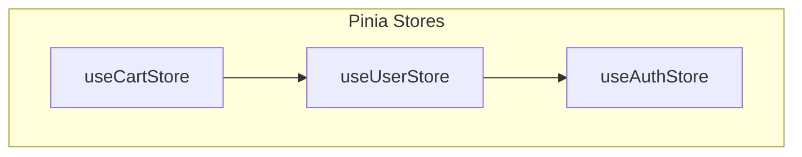
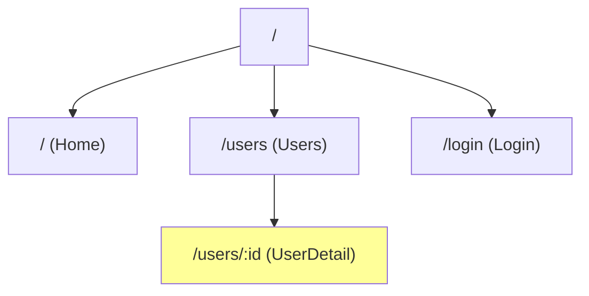
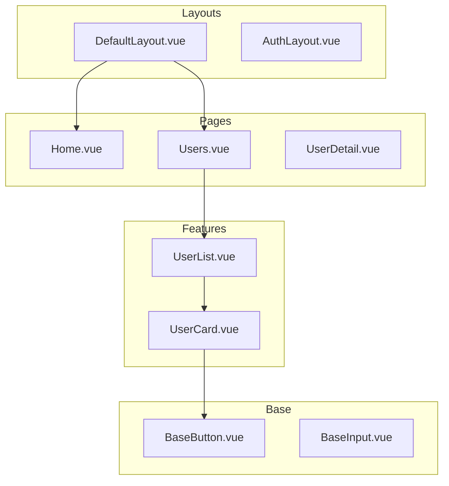
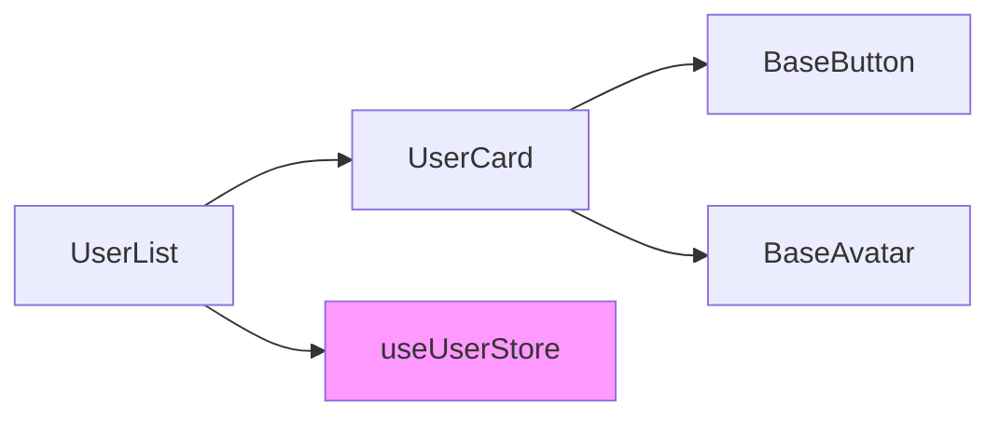
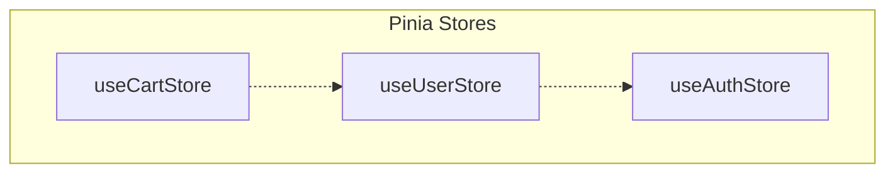
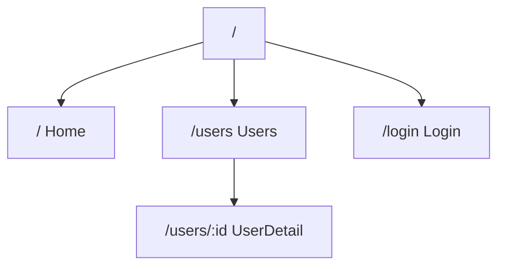

# Vue Project Analyzer

Vue 2/3 프로젝트의 구조, 컴포넌트 의존성, 상태관리, 라우팅을 분석하여 종합 문서를 생성합니다.

## 실행 프로세스 개요

```
┌─────────────────────────────────────────────────────────────────┐
│              VUE PROJECT ANALYSIS PROCESS                       │
├─────────────────────────────────────────────────────────────────┤
│                                                                  │
│  Phase 0: INTENT CLARIFICATION (선택)                            │
│     └─ 프로젝트 경로 확인/자동 탐색                               │
│                                                                  │
│  Phase 1: PROJECT META DISCOVERY                                 │
│     └─ package.json 분석                                         │
│     └─ Vue 버전 감지 (2.x/3.x)                                   │
│     └─ 빌드 도구 감지 (Vite/Vue CLI/Webpack)                     │
│                                                                  │
│  Phase 2: DIRECTORY STRUCTURE ANALYSIS                           │
│     └─ 소스 구조 파악                                            │
│     └─ 컴포넌트/store/router 위치 식별                            │
│                                                                  │
│  Phase 3: COMPONENT ANALYSIS                                     │
│     └─ .vue 파일 스캔 및 파싱                                     │
│     └─ 컴포넌트 분류 (Page, Layout, Common, Feature, Base)       │
│     └─ 의존성 그래프 구축                                        │
│                                                                  │
│  Phase 4: STATE MANAGEMENT ANALYSIS                              │
│     └─ Pinia stores 분석 (Vue 3)                                 │
│     └─ Vuex modules 분석 (Vue 2/3)                               │
│                                                                  │
│  Phase 5: ROUTING ANALYSIS                                       │
│     └─ 라우트 트리 구조                                          │
│     └─ 동적/중첩 라우트                                          │
│     └─ 네비게이션 가드                                           │
│                                                                  │
│  Phase 6: DEPENDENCY ANALYSIS                                    │
│     └─ npm 패키지 분류                                           │
│     └─ Vue 플러그인 식별                                         │
│                                                                  │
│  Phase 7: DOCUMENTATION                                          │
│     └─ ARCHITECTURE.md 생성                                      │
│     └─ analysis-data.json 생성                                   │
│     └─ Mermaid 다이어그램 생성                                   │
│                                                                  │
│  Phase 8: VERIFICATION                                           │
│     └─ 자동/수동 검증                                            │
│                                                                  │
└─────────────────────────────────────────────────────────────────┘
```

---

## Phase 0: 의도 명확화 (선택적)

프로젝트 경로가 명시되지 않은 경우 자동 탐색 또는 확인합니다.

### 자동 탐색

```bash
# 현재 디렉토리에서 Vue 프로젝트 확인
test -f "package.json" && grep -q "vue" package.json && echo "Vue 프로젝트 발견"

# 또는 하위 디렉토리 탐색
find . -maxdepth 2 -name "package.json" -exec grep -l "\"vue\"" {} \; | head -1
```

### 확인 사항

| 항목 | 확인 방법 | 기본값 |
|------|----------|--------|
| project_path | 자동 탐색 또는 사용자 입력 | 현재 디렉토리 |
| output_dir | 사용자 입력 | `./docs/architecture` |
| analysis_depth | 사용자 선택 | `shallow` |

---

## Phase 1: 프로젝트 메타 파악

### 1.1 package.json 분석

```json
{
  "name": "my-vue-app",
  "dependencies": {
    "vue": "^3.4.0",           // Vue 버전
    "vue-router": "^4.2.0",    // 라우터 버전
    "pinia": "^2.1.0"          // 상태관리
  },
  "devDependencies": {
    "@vitejs/plugin-vue": "^5.0.0"  // 빌드 도구
  }
}
```

### 1.2 Vue 버전 감지

| 감지 대상 | Vue 2 지표 | Vue 3 지표 |
|----------|-----------|-----------|
| 패키지 버전 | `vue@2.x` | `vue@3.x` |
| 라우터 | `vue-router@3.x` | `vue-router@4.x` |
| 상태관리 | `vuex@3.x` | `pinia` 또는 `vuex@4.x` |
| 코드 패턴 | `new Vue()` | `createApp()` |
| 컴포넌트 | `Vue.component()` | `<script setup>` |

### 1.3 빌드 도구 감지

| 빌드 도구 | 감지 파일/패턴 |
|-----------|--------------|
| **Vite** | `vite.config.{js,ts}`, `@vitejs/plugin-vue` |
| **Vue CLI** | `vue.config.js`, `@vue/cli-service` |
| **Webpack** | `webpack.config.js`, `vue-loader` |

### 1.4 수집 데이터

```json
{
  "projectMeta": {
    "name": "my-vue-app",
    "vueVersion": "3.4.0",
    "vueGeneration": "3.x",
    "buildTool": "vite",
    "typescript": true,
    "stateManagement": "pinia",
    "router": "vue-router@4.x",
    "uiFramework": "element-plus"
  }
}
```

---

## Phase 2: 디렉토리 구조 분석

### 2.1 일반적인 Vue 프로젝트 구조

```
src/
├── assets/           # 정적 자원
├── components/       # 재사용 컴포넌트
│   ├── common/       # 공통 컴포넌트
│   ├── base/         # 기초 UI 컴포넌트
│   └── features/     # 기능별 컴포넌트
├── views/            # 페이지 컴포넌트 (또는 pages/)
├── layouts/          # 레이아웃 컴포넌트
├── stores/           # Pinia stores (또는 store/)
├── router/           # Vue Router 설정
├── composables/      # Composition API 훅 (Vue 3)
├── mixins/           # 믹스인 (Vue 2)
├── utils/            # 유틸리티 함수
├── types/            # TypeScript 타입
└── App.vue           # 루트 컴포넌트
```

### 2.2 디렉토리 스캔 전략

```
1. src/ 디렉토리 존재 확인
2. 컴포넌트 위치 패턴 탐색:
   - src/components/**/*.vue
   - src/views/**/*.vue (또는 pages/)
   - src/layouts/**/*.vue
3. 상태관리 위치 탐색:
   - src/stores/**/*.{js,ts} (Pinia)
   - src/store/**/*.{js,ts} (Vuex)
4. 라우터 위치 탐색:
   - src/router/**/*.{js,ts}
```

---

## Phase 3: 컴포넌트 분석

### 3.1 컴포넌트 분류 기준

| 카테고리 | 패턴 | 설명 |
|----------|------|------|
| **Page** | `views/**`, `pages/**` | 라우트 엔드포인트 |
| **Layout** | `layouts/**`, `*Layout.vue` | 레이아웃 래퍼 |
| **Common** | `components/common/**`, `components/shared/**` | 공통 UI |
| **Feature** | `components/features/**`, `components/modules/**` | 기능별 컴포넌트 |
| **Base** | `components/base/**`, `components/ui/**`, `Base*.vue` | 기초 UI |

### 3.2 SFC (Single File Component) 파싱

#### Vue 3 Composition API (`<script setup>`)

```vue
<script setup lang="ts">
import { ref, computed } from 'vue'
import BaseButton from '@/components/base/BaseButton.vue'

// Props
const props = defineProps<{
  title: string
  count?: number
}>()

// Emits
const emit = defineEmits<{
  update: [value: string]
  close: []
}>()

// Slots는 템플릿에서 확인
</script>
```

**추출 정보:**
- `defineProps`: Props 정의
- `defineEmits`: 이벤트 정의
- `import` 문: 컴포넌트 의존성

#### Vue 2/3 Options API

```vue
<script>
export default {
  name: 'MyComponent',
  props: {
    title: { type: String, required: true },
    count: { type: Number, default: 0 }
  },
  emits: ['update', 'close'],
  // ...
}
</script>
```

### 3.3 의존성 그래프 구축

```
컴포넌트 A
  ├── import → 컴포넌트 B
  ├── import → 컴포넌트 C
  └── import → composable/useAuth
```

**분석 방법:**
1. `import` 문에서 `.vue` 파일 추출
2. 동적 import `() => import('...')` 감지
3. `defineAsyncComponent` 패턴 감지
4. alias 경로 해석 (`@/`, `~/`)

### 3.4 Alias 경로 해석

```javascript
// vite.config.ts
resolve: {
  alias: {
    '@': path.resolve(__dirname, 'src'),
    '~': path.resolve(__dirname, 'src')
  }
}

// tsconfig.json
{
  "compilerOptions": {
    "paths": {
      "@/*": ["src/*"]
    }
  }
}
```

---

## Phase 4: 상태관리 분석

### 4.1 Pinia Store 분석 (Vue 3)

```typescript
// stores/user.ts
import { defineStore } from 'pinia'
import { useAuthStore } from './auth'  // Store 간 의존성

export const useUserStore = defineStore('user', {
  state: () => ({
    users: [] as User[],
    currentUser: null as User | null
  }),

  getters: {
    userCount: (state) => state.users.length,
    isLoggedIn: (state) => !!state.currentUser
  },

  actions: {
    async fetchUsers() {
      // ...
    },
    setCurrentUser(user: User) {
      // ...
    }
  }
})
```

**추출 정보:**
| 항목 | 추출 방법 |
|------|----------|
| Store 이름 | `defineStore('name', ...)` |
| State | `state` 속성 |
| Getters | `getters` 속성 |
| Actions | `actions` 속성 |
| Store 의존성 | 다른 store import |

### 4.2 Vuex Module 분석 (Vue 2/3)

```javascript
// store/modules/user.js
export default {
  namespaced: true,

  state: () => ({
    users: [],
    currentUser: null
  }),

  getters: {
    userCount: (state) => state.users.length
  },

  mutations: {
    SET_USERS(state, users) { ... },
    SET_CURRENT_USER(state, user) { ... }
  },

  actions: {
    async fetchUsers({ commit }) { ... }
  }
}
```

### 4.3 상태관리 구조 다이어그램



---

## Phase 5: 라우팅 분석

### 5.1 라우트 정의 파싱

```typescript
// router/index.ts
const routes: RouteRecordRaw[] = [
  {
    path: '/',
    component: () => import('@/layouts/DefaultLayout.vue'),
    children: [
      {
        path: '',
        name: 'Home',
        component: () => import('@/views/Home.vue')
      },
      {
        path: 'users',
        name: 'Users',
        component: () => import('@/views/Users.vue'),
        meta: { requiresAuth: true }
      },
      {
        path: 'users/:id',
        name: 'UserDetail',
        component: () => import('@/views/UserDetail.vue'),
        props: true
      }
    ]
  },
  {
    path: '/login',
    name: 'Login',
    component: () => import('@/views/Login.vue')
  }
]
```

### 5.2 추출 정보

| 항목 | 설명 |
|------|------|
| **path** | 라우트 경로 |
| **name** | 라우트 이름 |
| **component** | 연결된 컴포넌트 |
| **children** | 중첩 라우트 |
| **meta** | 메타 정보 (인증 등) |
| **props** | props 전달 여부 |
| **동적 세그먼트** | `:id`, `:slug` 등 |

### 5.3 네비게이션 가드 분석

```typescript
// 전역 가드
router.beforeEach((to, from, next) => {
  if (to.meta.requiresAuth && !isAuthenticated()) {
    next('/login')
  } else {
    next()
  }
})

// 라우트별 가드
{
  path: '/admin',
  beforeEnter: (to, from, next) => { ... }
}
```

### 5.4 라우트 트리 다이어그램



---

## Phase 6: 의존성 분석

### 6.1 패키지 분류

| 분류 | 패키지 예시 |
|------|-----------|
| **Core** | vue, vue-router, pinia/vuex |
| **UI Framework** | element-plus, vuetify, ant-design-vue |
| **HTTP** | axios, ky, ofetch |
| **Utility** | lodash, dayjs, vueuse |
| **Development** | typescript, vite, eslint |

### 6.2 Vue 플러그인 식별

```typescript
// main.ts
import { createApp } from 'vue'
import ElementPlus from 'element-plus'
import { createPinia } from 'pinia'

const app = createApp(App)
app.use(createPinia())
app.use(ElementPlus)
app.use(router)
app.mount('#app')
```

**식별 대상:**
- `app.use()` 호출
- 전역 컴포넌트 등록
- 전역 디렉티브 등록

---

## Phase 7: 문서 생성

### 7.1 ARCHITECTURE.md

**필수 섹션:**

```markdown
# Vue 프로젝트 아키텍처

## 개요
- 프로젝트명, Vue 버전, 빌드 도구
- 주요 의존성

## 디렉토리 구조
[트리 구조 표시]

## 컴포넌트 분석
### 컴포넌트 분류
[카테고리별 컴포넌트 테이블]

### 컴포넌트 의존성
[Mermaid 다이어그램 포함]

## 상태관리 분석
### Store 구조
[Pinia/Vuex 구조]

### Store 의존성
[다이어그램]

## 라우팅 분석
### 라우트 트리
[라우트 구조 테이블]

### 네비게이션 가드
[가드 목록]

## 의존성 분석
### 주요 패키지
[패키지 테이블]

### Vue 플러그인
[플러그인 목록]
```

### 7.2 analysis-data.json

```json
{
  "meta": {
    "generated_at": "2024-01-15T10:00:00Z",
    "skill_version": "1.0.0",
    "project_path": "./frontend"
  },
  "project": {
    "name": "my-vue-app",
    "vueVersion": "3.4.0",
    "vueGeneration": "3.x",
    "buildTool": "vite",
    "typescript": true,
    "stateManagement": "pinia"
  },
  "components": [
    {
      "name": "UserList",
      "path": "src/components/features/user/UserList.vue",
      "category": "Feature",
      "props": [...],
      "emits": [...],
      "dependencies": [...]
    }
  ],
  "stores": {
    "type": "pinia",
    "stores": [...]
  },
  "routes": {
    "routes": [...],
    "guards": [...]
  },
  "dependencies": {
    "packages": [...],
    "plugins": [...]
  }
}
```

### 7.3 Mermaid 다이어그램

#### component-tree.mmd



#### component-deps.mmd



#### store-structure.mmd



#### route-tree.mmd



---

## Phase 8: 검증

### 8.1 자동 검증

```bash
bash .claude/skills/vue-project-analyzer/verification/run-verification.sh \
  --output-dir ./docs/architecture \
  --project-path .
```

### 8.2 검증 체크리스트

**MUST (필수):**
- [ ] ARCHITECTURE.md 파일 생성됨
- [ ] analysis-data.json 유효한 JSON
- [ ] component-tree.mmd 생성됨
- [ ] component-deps.mmd 생성됨
- [ ] 모든 .vue 파일이 분석에 포함됨

**SHOULD (권장):**
- [ ] 모든 컴포넌트가 카테고리로 분류됨
- [ ] Mermaid 다이어그램 문법 유효
- [ ] 상태관리 구조가 정확히 분석됨
- [ ] 라우팅 구조가 정확히 문서화됨

**MANUAL (수동 확인):**
- [ ] 컴포넌트 분류가 실제 용도와 일치
- [ ] 의존성 그래프가 실제 import와 일치
- [ ] Store 간 의존성이 정확히 표현됨

---

## 오류 복구

| 상황 | 원인 | 조치 |
|------|------|------|
| Vue 버전 감지 실패 | 비표준 설정 | package.json 수동 확인 |
| 컴포넌트 파싱 실패 | 비표준 SFC | 해당 파일 건너뛰기, 수동 추가 |
| Alias 해석 실패 | 설정 파일 없음 | 상대 경로로 폴백 |
| Store 감지 실패 | 비표준 위치 | 경로 수동 지정 |
| 순환 의존성 감지 | 아키텍처 문제 | Warning으로 보고 |

---

## Quick Reference

| 명령 | 용도 |
|------|------|
| `find src -name "*.vue"` | Vue 컴포넌트 파일 목록 |
| `grep -r "defineProps" src` | Props 정의 검색 |
| `grep -r "defineStore" src` | Pinia store 검색 |
| `grep -r "createRouter" src` | 라우터 설정 검색 |

---

## 출력물 예시

### 생성되는 파일 구조

```
{output_dir}/
├── ARCHITECTURE.md           # 종합 아키텍처 문서
├── analysis-data.json        # 구조화된 분석 데이터
└── diagrams/
    ├── component-tree.mmd    # 컴포넌트 계층 구조
    ├── component-deps.mmd    # 컴포넌트 의존성 그래프
    ├── store-structure.mmd   # 상태관리 구조
    └── route-tree.mmd        # 라우팅 구조
```
