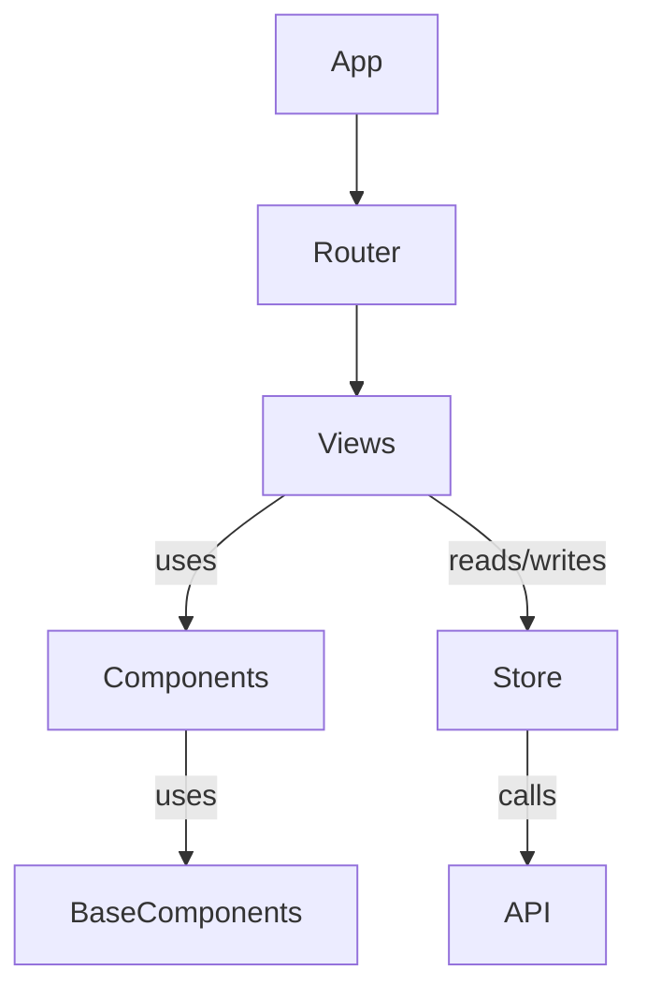
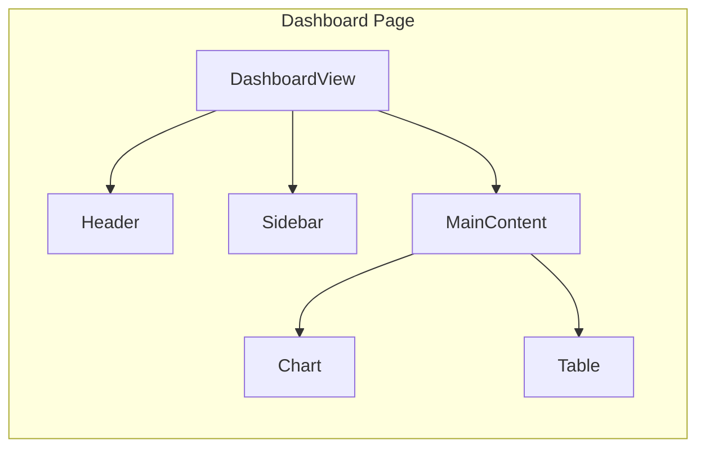
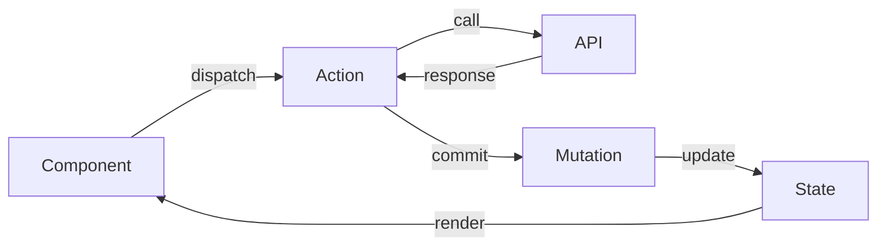

# Vue Project Analyzer

대규모 Vue 프로젝트를 체계적으로 분석하고 문서화하는 스킬.

## 분석 워크플로우

**전체 흐름:** 진입점 파악 → 구조 분류 → 모듈 분석 → 문서 생성

### Phase 1: 진입점 파악 (5분)

```bash
# 1. 프로젝트 메타 정보
cat package.json | head -50

# 2. 빌드 설정 확인
ls -la vite.config.* vue.config.* nuxt.config.* 2>/dev/null

# 3. 앱 초기화 흐름
cat src/main.ts 2>/dev/null || cat src/main.js
```

**수집 항목:**
- Vue 버전 (2.x / 3.x)
- 빌드 도구 (Vite / Webpack / Nuxt)
- 상태관리 (Vuex / Pinia / 없음)
- 라우터 사용 여부
- TypeScript 사용 여부
- UI 프레임워크 (Vuetify / Element / Quasar 등)

### Phase 2: 구조 분류 (10분)

```bash
# 디렉토리 구조 파악
find src -type d -maxdepth 3 | head -50

# Vue 파일 분포
find src -name "*.vue" | wc -l
find src -name "*.vue" -path "*/views/*" | wc -l
find src -name "*.vue" -path "*/components/*" | wc -l
find src -name "*.vue" -path "*/pages/*" | wc -l

# 라우트 구조 = 기능 목록
cat src/router/index.ts 2>/dev/null || cat src/router/index.js
```

**아키텍처 패턴 식별:**

| 패턴 | 특징 | 분석 전략 |
|------|------|----------|
| Pages-based | `pages/` 폴더, 파일 기반 라우팅 | 페이지별 수직 분석 |
| Views/Components | `views/` + `components/` 분리 | 라우트 기준 분석 |
| Feature-based | `features/` 또는 `modules/` | 도메인별 분석 |
| Atomic Design | `atoms/molecules/organisms/` | 계층별 분석 |

### Phase 3: 모듈별 상세 분석 (모듈당 10-15분)

**3.1 라우트 기반 기능 목록화**

```bash
# 라우트에서 기능 추출
grep -E "path:|component:|name:" src/router/*.ts 2>/dev/null || \
grep -E "path:|component:|name:" src/router/*.js
```

**3.2 컴포넌트 의존성 분석**

```bash
# 가장 많이 import되는 컴포넌트 (핵심 컴포넌트)
grep -rh "import.*from.*components" src --include="*.vue" --include="*.ts" --include="*.js" | \
  sed "s/.*from ['\"]//;s/['\"].*//" | sort | uniq -c | sort -rn | head -20

# 특정 컴포넌트의 사용처
grep -rl "ComponentName" src --include="*.vue"
```

**3.3 스토어 구조 분석**

```bash
# Pinia stores
find src -name "*.ts" -path "*stores*" -o -name "*.ts" -path "*store*"

# Vuex modules
find src -name "*.ts" -path "*store/modules*" -o -name "*.js" -path "*store/modules*"
```

**3.4 API 계층 분석**

```bash
# API 호출 패턴
find src -type f \( -path "*api*" -o -path "*services*" \) -name "*.ts" -o -name "*.js"

# API 엔드포인트 추출
grep -rh "axios\|fetch\|api\." src --include="*.ts" --include="*.js" | head -30
```

### Phase 4: 문서 자동 생성

분석 완료 후 다음 문서들을 생성:

1. **ARCHITECTURE.md** - `scripts/generate_architecture.py` 실행
2. **컴포넌트 다이어그램** - Mermaid 형식
3. **라우트 맵** - 페이지 구조 시각화

## 출력 문서 템플릿

### ARCHITECTURE.md 구조

```markdown
# [프로젝트명] Architecture

## 개요
- Vue 버전: 
- 빌드 도구:
- 상태관리:

## 디렉토리 구조
[tree 출력]

## 핵심 모듈
| 모듈 | 위치 | 역할 |
|------|------|------|

## 컴포넌트 계층
[Mermaid 다이어그램]

## 데이터 흐름
[Mermaid 다이어그램]

## API 엔드포인트
| 엔드포인트 | 메서드 | 설명 |
|-----------|--------|------|

## 주요 의존성
[외부 라이브러리 목록]
```

## 다이어그램 생성 패턴

### 컴포넌트 계층도



### 페이지별 컴포넌트 맵



### 상태 흐름도



## 분석 명령어 Quick Reference

| 목적 | 명령어 |
|------|--------|
| Vue 파일 총 개수 | `find src -name "*.vue" \| wc -l` |
| 컴포넌트별 LOC | `wc -l src/components/**/*.vue` |
| 미사용 컴포넌트 후보 | `scripts/find_unused.sh` |
| 순환 의존성 | `scripts/check_circular.sh` |
| 타입 커버리지 | `npx type-coverage` |

## Claude 행동 규칙

**Phase 순서 준수:**
- 반드시 Phase 1 → 2 → 3 → 4 순서로 진행
- Phase 1 완료 전 프로젝트 구조에 대한 결론 도출 금지
- 각 Phase 완료 후 발견 사항을 사용자에게 보고

**명령어 실행:**
- 명령어 실패 시 대체 명령어 시도 (`.ts` → `.js`, `src/` → `app/`)
- 결과가 없거나 에러 발생 시 대체 경로 탐색
- `2>/dev/null` 사용하여 에러 메시지 숨김 처리

**사용자 확인 필요 시점:**
- 아키텍처 패턴이 불분명할 때 (Phase 2 → 3 전환 시)
- 예상과 다른 프로젝트 구조 발견 시
- 분석 범위 결정이 필요할 때 (전체 vs 특정 모듈)

**출력 품질:**
- Mermaid 다이어그램은 fenced code block으로 출력
- ARCHITECTURE.md 생성 시 템플릿 구조 준수
- 분석 결과는 테이블 형식으로 정리하여 가독성 확보

## 에러 대응

| 상황 | 대응 방법 |
|------|----------|
| `src/` 폴더 없음 | `app/`, `lib/`, `client/` 확인. 설정 파일에서 소스 경로 확인 |
| Vue 파일 없음 | `package.json`으로 Vue 프로젝트 여부 확인. Nuxt/Quasar 등 메타 프레임워크 검토 |
| 라우터 파일 없음 | Nuxt 파일 기반 라우팅 또는 `pages/` 폴더 확인 |
| TypeScript 파일 없음 | `.js` 확장자로 대체 검색 |
| 스토어 없음 | Composition API의 `provide/inject` 또는 composables 패턴 확인 |
| `package.json` 없음 | 모노레포 구조 확인. 상위/하위 디렉토리 탐색 |
| 빌드 설정 없음 | `vue.config.js`, `vite.config.ts`, `nuxt.config.ts` 순차 확인 |

**대체 경로 탐색 순서:**
```
소스 코드: src/ → app/ → lib/ → client/ → .
라우터: src/router/ → src/routes/ → pages/ (파일 기반)
스토어: src/stores/ → src/store/ → src/state/
API: src/api/ → src/services/ → src/http/ → src/requests/
```

## 참고 자료

- **상세 분석 패턴**: `references/analysis-patterns.md`
- **Vue 2 → 3 마이그레이션 체크리스트**: `references/migration-checklist.md`
