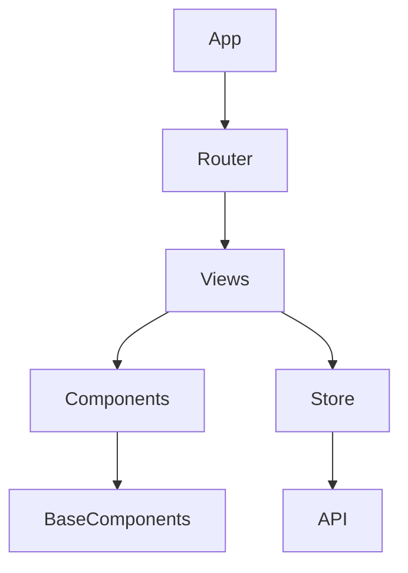
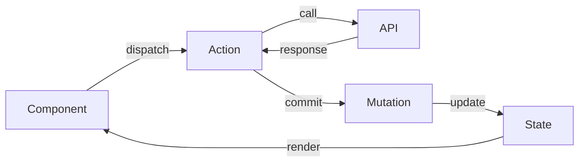

# Vue Project Analyzer

대규모 Vue 프로젝트를 체계적으로 분석하고 문서화합니다.

## Workflow

**흐름:** 진입점 파악 → 구조 분류 → 모듈 분석 → 문서 생성

**상세 명령어**: [references/phase-commands.md](references/phase-commands.md)

### Phase 1: 진입점 파악

`package.json`, 빌드 설정, `main.ts`를 확인하여 수집:
- Vue 버전 (2.x / 3.x)
- 빌드 도구 (Vite / Webpack / Nuxt)
- 상태관리 (Vuex / Pinia)
- TypeScript 사용 여부
- UI 프레임워크

### Phase 2: 구조 분류

| 패턴 | 특징 | 분석 전략 |
|------|------|----------|
| Pages-based | `pages/` 파일 기반 라우팅 | 페이지별 수직 분석 |
| Views/Components | `views/` + `components/` 분리 | 라우트 기준 분석 |
| Feature-based | `features/` 도메인 모듈 | 도메인별 분석 |
| Atomic Design | `atoms/molecules/organisms/` | 계층별 분석 |

### Phase 3: 모듈 분석

- 라우트 기반 기능 목록화
- 컴포넌트 의존성 분석
- 스토어 구조 분석
- API 계층 분석

### Phase 4: 문서 생성

1. **ARCHITECTURE.md** - `scripts/generate_architecture.py` 실행
2. **컴포넌트 다이어그램** - Mermaid 형식
3. **라우트 맵** - 페이지 구조 시각화

## Output Template

```markdown
# [프로젝트명] Architecture

## 개요
- Vue 버전: 
- 빌드 도구:
- 상태관리:

## 디렉토리 구조
[tree 출력]

## 핵심 모듈
| 모듈 | 위치 | 역할 |

## 컴포넌트 계층
[Mermaid 다이어그램]

## API 엔드포인트
| 엔드포인트 | 메서드 | 설명 |
```

## Diagrams

### 컴포넌트 계층도



### 상태 흐름도



## Quick Reference

| 목적 | 명령어 |
|------|--------|
| Vue 파일 수 | `find src -name "*.vue" \| wc -l` |
| 컴포넌트별 LOC | `wc -l src/components/**/*.vue` |
| 미사용 컴포넌트 | `scripts/find_unused.sh` |
| 순환 의존성 | `scripts/check_circular.sh` |

## 참고

- **상세 분석 패턴**: [references/analysis-patterns.md](references/analysis-patterns.md)
- **Vue 2→3 마이그레이션**: [references/migration-checklist.md](references/migration-checklist.md)
