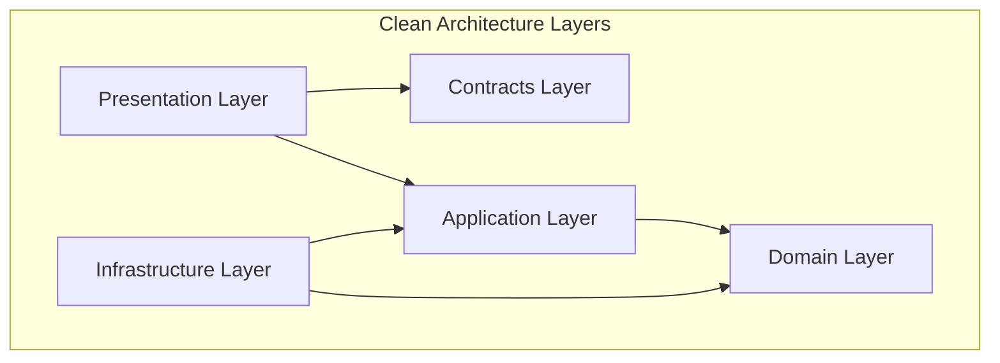

# .NET Project Analyzer

.NET 솔루션의 구조, 프로젝트 의존성, NuGet 패키지, 아키텍처 패턴을 분석하여 종합 문서를 생성합니다.

## 실행 프로세스 개요

```
┌─────────────────────────────────────────────────────────────────┐
│              .NET PROJECT ANALYSIS PROCESS                       │
├─────────────────────────────────────────────────────────────────┤
│                                                                  │
│  Phase 0: INTENT CLARIFICATION (선택)                            │
│     └─ 솔루션 경로 확인/자동 탐색                                 │
│                                                                  │
│  Phase 1: SOLUTION DISCOVERY                                     │
│     └─ .sln/.slnx 파싱                                           │
│     └─ 프로젝트 목록 추출                                        │
│                                                                  │
│  Phase 2: PROJECT ANALYSIS                                       │
│     └─ .csproj 파싱                                              │
│     └─ 의존성 수집 (ProjectReference, PackageReference)          │
│                                                                  │
│  Phase 3: ARCHITECTURE ANALYSIS                                  │
│     └─ 레이어 분류 (Clean Architecture)                          │
│     └─ 의존성 방향 검증                                          │
│     └─ CQRS 패턴 감지                                            │
│                                                                  │
│  Phase 4: NUGET ANALYSIS                                         │
│     └─ 패키지 버전 현황                                          │
│     └─ 중복/불일치 감지                                          │
│                                                                  │
│  Phase 5: DOCUMENTATION                                          │
│     └─ ARCHITECTURE.md 생성                                      │
│     └─ analysis-data.json 생성                                   │
│     └─ Mermaid 다이어그램 생성                                   │
│                                                                  │
│  Phase 6: VERIFICATION                                           │
│     └─ 자동/수동 검증                                            │
│                                                                  │
└─────────────────────────────────────────────────────────────────┘
```

---

## Phase 0: 의도 명확화 (선택적)

솔루션 경로가 명시되지 않은 경우 자동 탐색 또는 확인합니다.

### 자동 탐색

```bash
# 현재 디렉토리에서 솔루션 파일 탐색
ls *.sln *.slnx 2>/dev/null | head -1

# 또는 재귀 탐색
find . -maxdepth 2 -name "*.sln" -o -name "*.slnx" 2>/dev/null | head -1
```

### 확인 사항

| 항목 | 확인 방법 | 기본값 |
|------|----------|--------|
| solution_path | 자동 탐색 또는 사용자 입력 | 현재 디렉토리 |
| output_dir | 사용자 입력 | `./docs/architecture` |
| check_nuget_updates | NuGet 관련 언급 시 true | false |

---

## Phase 1: 솔루션 파악

### 1.1 솔루션 파일 형식 감지

```
.sln  → 전통적인 솔루션 파일 (텍스트 기반)
.slnx → XML 기반 솔루션 파일 (SDK 스타일)
```

### 1.2 .slnx 파싱 (XML 형식)

```xml
<Solution>
  <Folder Name="/Domain/">
    <Project Path="src/Domain/MyProject.Core/MyProject.Core.csproj" />
  </Folder>
  <Folder Name="/Application/">
    <Project Path="src/Application/MyProject.Application/MyProject.Application.csproj" />
  </Folder>
</Solution>
```

**추출 정보:**
- 솔루션 폴더 구조 (레이어 힌트)
- 프로젝트 경로 목록

### 1.3 .sln 파싱 (텍스트 형식)

```
Project("{GUID}") = "ProjectName", "Path\To\Project.csproj", "{PROJECT-GUID}"
```

**정규식 패턴:**
```regex
Project\("\{[^}]+\}"\)\s*=\s*"([^"]+)",\s*"([^"]+\.csproj)"
```

### 1.4 수집 데이터

| 항목 | 설명 |
|------|------|
| solution_name | 솔루션 파일명 |
| solution_format | .sln 또는 .slnx |
| folders | 솔루션 폴더 구조 |
| projects | 프로젝트 경로 목록 |

---

## Phase 2: 프로젝트 분석

### 2.1 .csproj 파싱

각 프로젝트 파일에서 다음 정보 추출:

```xml
<Project Sdk="Microsoft.NET.Sdk.Web">
  <PropertyGroup>
    <TargetFramework>net10.0</TargetFramework>
    <AssemblyName>MyProject.Api</AssemblyName>
  </PropertyGroup>

  <ItemGroup>
    <ProjectReference Include="..\Core\MyProject.Core.csproj" />
  </ItemGroup>

  <ItemGroup>
    <PackageReference Include="Serilog" Version="3.0.0" />
  </ItemGroup>
</Project>
```

### 2.2 추출 정보

| 요소 | XPath/패턴 | 설명 |
|------|-----------|------|
| SDK | `Project/@Sdk` | 프로젝트 SDK 유형 |
| TargetFramework | `PropertyGroup/TargetFramework` | 대상 프레임워크 |
| AssemblyName | `PropertyGroup/AssemblyName` | 어셈블리 이름 |
| ProjectReference | `ItemGroup/ProjectReference/@Include` | 프로젝트 참조 |
| PackageReference | `ItemGroup/PackageReference` | NuGet 패키지 |

### 2.3 의존성 그래프 구축

```
프로젝트 A
  ├── ProjectReference → 프로젝트 B
  ├── ProjectReference → 프로젝트 C
  └── PackageReference
      ├── Package X (1.0.0)
      └── Package Y (2.0.0)
```

---

## Phase 3: 아키텍처 분석

### 3.1 Clean Architecture 레이어 분류

프로젝트 이름 패턴을 기반으로 레이어 자동 분류:

| 레이어 | 패턴 | 허용 의존성 |
|--------|------|-------------|
| **Domain** | `*.Core`, `*.Domain`, `*.Entities` | (없음) |
| **Application** | `*.Application`, `*.UseCases` | Domain |
| **Infrastructure** | `*.Infrastructure.*`, `*.Persistence` | Domain, Application |
| **Presentation** | `*.Api`, `*.Web`, `*.Portal` | Domain, Application, Infrastructure, Contracts |
| **Contracts** | `*.Contracts`, `*.Shared` | (없음) |
| **Tests** | `*.Tests`, `*.UnitTests` | (모두 허용) |

### 3.2 분류 알고리즘

```
1. 프로젝트 이름에서 패턴 매칭
2. 솔루션 폴더 구조 참고 (보조 힌트)
3. 매칭되지 않으면 "Unclassified"
```

### 3.3 의존성 방향 검증

```
┌─────────────────────────────────────────────────┐
│  허용된 의존성 방향 (Clean Architecture)         │
├─────────────────────────────────────────────────┤
│                                                  │
│    Presentation  ─────────────────────┐         │
│         │                             │         │
│         ▼                             │         │
│    Application  ◄── Infrastructure    │         │
│         │              │              │         │
│         ▼              │              │         │
│       Domain  ◄────────┘              │         │
│         ▲                             │         │
│         │                             │         │
│    Contracts ◄────────────────────────┘         │
│                                                  │
└─────────────────────────────────────────────────┘
```

### 3.4 위반 감지 규칙

| 위반 유형 | 설명 | 심각도 |
|----------|------|--------|
| Domain 외부 참조 | Domain이 다른 레이어 참조 | Critical |
| 역방향 의존성 | 상위 → 하위 레이어 참조 | Critical |
| 순환 참조 | A → B → A | Critical |
| Application → Infrastructure | 직접 참조 (인터페이스 필요) | Warning |

### 3.5 CQRS 패턴 감지

다음 패턴이 존재하면 CQRS 사용으로 판단:

```
IQueryRepository / ICommandRepository
QueryHandler / CommandHandler
Dapper (Query) + EF Core (Command) 조합
```

---

## Phase 4: NuGet 분석

### 4.1 패키지 수집

모든 프로젝트의 PackageReference 수집:

```
패키지명 → [프로젝트A:버전1, 프로젝트B:버전2, ...]
```

### 4.2 분석 항목

| 항목 | 설명 |
|------|------|
| 총 패키지 수 | 고유 패키지 개수 |
| 버전 불일치 | 동일 패키지의 다른 버전 사용 |
| 중복 패키지 | 여러 프로젝트에서 사용 |
| 취약 버전 | (check_nuget_updates=true 시) |

### 4.3 버전 불일치 감지

```
패키지: Serilog
  ├── ProjectA: 3.0.0
  └── ProjectB: 2.5.0  ← 버전 불일치!
```

---

## Phase 5: 문서 생성

### 5.1 ARCHITECTURE.md

**필수 섹션:**

```markdown
# 솔루션 아키텍처

## 개요
- 솔루션명, 형식, SDK 버전
- 총 프로젝트 수

## 프로젝트 구조
[레이어별 프로젝트 테이블]

## 의존성 그래프
[Mermaid 다이어그램 포함]

## 레이어 분석
- Clean Architecture 준수 여부
- CQRS 패턴 사용 여부

## 위반 사항
[Critical/Warning 목록]

## NuGet 패키지
- 총 패키지 수
- 버전 불일치 목록
```

### 5.2 analysis-data.json

```json
{
  "meta": {
    "generated_at": "2024-01-15T10:00:00Z",
    "skill_version": "1.0.0",
    "solution_path": "iam.slnx"
  },
  "solution": {
    "name": "iam",
    "format": ".slnx",
    "sdk_version": "net10.0"
  },
  "projects": [
    {
      "name": "Actoz.Iam.Core",
      "path": "src/Domain/Actoz.Iam.Core",
      "targetFramework": "net10.0",
      "layer": "Domain",
      "projectReferences": [],
      "packageReferences": [...]
    }
  ],
  "dependencies": {
    "graph": {...},
    "circular_references": []
  },
  "architecture": {
    "layers": {...},
    "violations": [...],
    "cqrs_detected": true
  },
  "nuget": {
    "total_packages": 25,
    "version_mismatches": [...]
  }
}
```

### 5.3 Mermaid 다이어그램

**dependency-graph.mmd:**

```mermaid
flowchart TD
    subgraph Presentation
        IdpApi[Actoz.Iam.IdpApi]
        AdminPortal[Actoz.Iam.AdminPortal]
    end

    subgraph Application
        App[Actoz.Iam.Application]
    end

    subgraph Infrastructure
        Persistence[Actoz.Iam.Infrastructure.Persistence]
        External[Actoz.Iam.Infrastructure.External]
    end

    subgraph Domain
        Core[Actoz.Iam.Core]
    end

    subgraph Contracts
        Contracts[Actoz.Iam.Contracts]
    end

    IdpApi --> App
    IdpApi --> Core
    IdpApi --> Persistence
    AdminPortal --> App
    App --> Core
    Persistence --> Core
```

**layer-architecture.mmd:**



### 5.4 API 섹션 작성 가이드

.NET API 프로젝트(`*.Api`, `*.Web`)에 대한 추가 분석:

**ARCHITECTURE.md에 포함할 내용:**

| 항목 | 설명 | 예시 |
|------|------|------|
| 엔드포인트 개요 | 주요 API 경로 | `/api/users`, `/api/orders` |
| 인증 방식 | 사용 중인 인증 | JWT, OAuth2 |
| 미들웨어 | 주요 미들웨어 | CORS, Logging |

**분석 방법:**
```
1. Program.cs에서 app.Map* 호출 확인
2. Controllers/ 폴더의 [Route] 속성 스캔
3. Startup.cs 또는 Program.cs에서 인증/미들웨어 설정 확인
```

### 5.5 컴포넌트 분석 가이드

프로젝트별 주요 컴포넌트 식별 가이드:

**분류 기준:**
| 패턴 | 유형 | 설명 |
|------|------|------|
| `I*Service` | 서비스 | 비즈니스 로직 인터페이스 및 구현 |
| `I*Repository` | 리포지토리 | 데이터 접근 인터페이스 및 구현 |
| `*Handler` | 핸들러 | CQRS 패턴의 Command/Query 핸들러 |
| `*Validator` | 밸리데이터 | FluentValidation 등 검증 로직 |

**analysis-data.json 포함 정보:**
```json
{
  "components": {
    "services": ["IUserService", "IOrderService"],
    "repositories": ["IUserRepository", "IOrderRepository"],
    "handlers": ["CreateUserHandler", "GetOrderQueryHandler"],
    "validators": ["CreateUserValidator"]
  }
}
```

### 5.6 의존성 섹션 상세 가이드

**버전 불일치 테이블 형식:**

| 패키지 | 버전들 | 영향 프로젝트 | 권장 조치 |
|--------|--------|--------------|----------|
| Serilog | 3.0.0, 2.5.0 | Api, Core | 3.0.0으로 통일 |

**순환 참조 표시:**
```
⚠️ 순환 참조 감지: ProjectA → ProjectB → ProjectA
```

**의존성 분석 체크포인트:**
- [ ] 동일 패키지의 다른 버전 사용 감지
- [ ] 직접 참조 vs 전이적 참조 구분
- [ ] 취약 버전 패키지 표시 (check_nuget_updates=true 시)

### 5.7 아키텍처 섹션 상세 가이드

**아키텍처 위반 보고 형식:**

```markdown
## 아키텍처 위반 사항

### Critical (즉시 조치 필요)
| 위반 | 출발 | 목적지 | 영향 |
|------|------|--------|------|
| Domain 외부 참조 | Actoz.Core | Actoz.Api | 핵심 도메인 오염 |

### Warning (검토 필요)
- `Application`이 `Infrastructure`를 직접 참조 (인터페이스 권장)
```

---

## Phase 6: 검증

### 6.1 자동 검증

```bash
bash .claude/skills/dotnet-project-analyzer/verification/run-verification.sh \
  --output-dir ./docs/architecture \
  --solution-path iam.slnx
```

### 6.2 검증 체크리스트

**MUST (필수):**
- [ ] ARCHITECTURE.md 파일 생성됨
- [ ] analysis-data.json 유효한 JSON
- [ ] dependency-graph.mmd 생성됨
- [ ] layer-architecture.mmd 생성됨
- [ ] 모든 프로젝트가 분석에 포함됨

**SHOULD (권장):**
- [ ] 모든 프로젝트가 레이어로 분류됨
- [ ] Mermaid 다이어그램 문법 유효
- [ ] NuGet 버전 불일치 정확히 감지됨

**MANUAL (수동 확인):**
- [ ] 레이어 분류가 실제 아키텍처와 일치
- [ ] 의존성 방향 위반이 정확히 감지됨

---

## 오류 복구

| 상황 | 원인 | 조치 |
|------|------|------|
| 솔루션 파일 없음 | 경로 오류 | 경로 확인, 자동 탐색 재실행 |
| .csproj 파싱 실패 | 비표준 형식 | 해당 프로젝트 건너뛰기, 수동 추가 |
| 레이어 분류 실패 | 패턴 매칭 안됨 | "Unclassified"로 표시, 수동 분류 |
| 순환 참조 감지됨 | 아키텍처 문제 | Critical 위반으로 보고 |
| JSON 생성 실패 | 데이터 오류 | 부분 데이터로 생성 |

---

## Quick Reference

| 명령 | 용도 |
|------|------|
| `ls *.sln *.slnx` | 솔루션 파일 탐색 |
| `grep -oP 'TargetFramework.*?</TargetFramework>'` | 대상 프레임워크 추출 |
| `grep -oP 'Include="[^"]*"'` | 참조 추출 |
| `dotnet list package` | NuGet 패키지 목록 (CLI) |

---

## 출력물 예시

### 생성되는 파일 구조

```
{output_dir}/
├── ARCHITECTURE.md           # 종합 아키텍처 문서
├── analysis-data.json        # 구조화된 분석 데이터
├── diagrams/
│   ├── dependency-graph.mmd  # 프로젝트 의존성 그래프
│   └── layer-architecture.mmd # 레이어 아키텍처 다이어그램
└── NUGET-REPORT.md           # (선택) NuGet 상세 리포트
```
