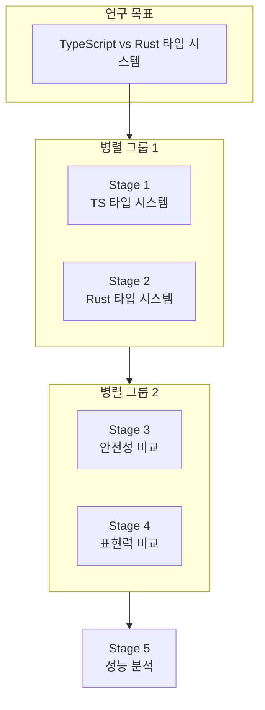
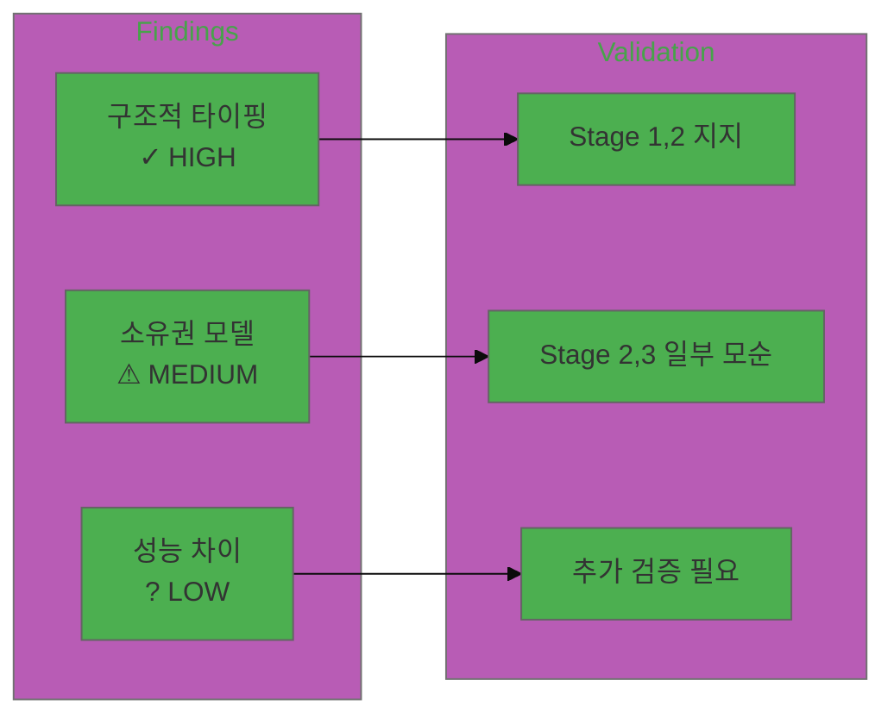

# Research Orchestrator - 병렬 연구 오케스트레이터

복잡한 연구 목표를 병렬 과학자 에이전트를 통해 체계적으로 수행합니다.

## 실행 프로세스 개요

```
┌─────────────────────────────────────────────────────────────────────────────┐
│                    RESEARCH ORCHESTRATION WORKFLOW                          │
├─────────────────────────────────────────────────────────────────────────────┤
│                                                                             │
│  ┌─────────────────┐                                                        │
│  │ RESEARCH GOAL   │  "TypeScript와 Rust의 타입 시스템 비교"                │
│  └────────┬────────┘                                                        │
│           │                                                                 │
│           ▼                                                                 │
│  ┌─────────────────────────────────────────────────────────────────┐       │
│  │ PHASE 1: DECOMPOSITION                                          │       │
│  │ ┌─────────┐ ┌─────────┐ ┌─────────┐ ┌─────────┐ ┌─────────┐   │       │
│  │ │Stage 1  │ │Stage 2  │ │Stage 3  │ │Stage 4  │ │Stage 5  │   │       │
│  │ │TS 타입  │ │Rust 타입│ │안전성   │ │표현력   │ │성능     │   │       │
│  │ └─────────┘ └─────────┘ └─────────┘ └─────────┘ └─────────┘   │       │
│  └─────────────────────────────────────────────────────────────────┘       │
│           │                                                                 │
│           ▼                                                                 │
│  ┌─────────────────────────────────────────────────────────────────┐       │
│  │ PHASE 2: PARALLEL EXECUTION                                     │       │
│  │                                                                 │       │
│  │  ┌──────────────┐  ┌──────────────┐  ┌──────────────┐          │       │
│  │  │ Scientist #1 │  │ Scientist #2 │  │ Scientist #3 │   ...    │       │
│  │  │   Stage 1    │  │   Stage 2    │  │   Stage 3    │          │       │
│  │  └──────┬───────┘  └──────┬───────┘  └──────┬───────┘          │       │
│  │         │                 │                 │                   │       │
│  │         ▼                 ▼                 ▼                   │       │
│  │     [결과 1]          [결과 2]          [결과 3]                │       │
│  └─────────────────────────────────────────────────────────────────┘       │
│           │                                                                 │
│           ▼                                                                 │
│  ┌─────────────────────────────────────────────────────────────────┐       │
│  │ PHASE 3: CROSS-VALIDATION                                       │       │
│  │                                                                 │       │
│  │  • 결과 간 일관성 검증                                           │       │
│  │  • 모순 탐지 및 해결                                             │       │
│  │  • 신뢰도 평가                                                   │       │
│  │  • 갭 분석                                                       │       │
│  └─────────────────────────────────────────────────────────────────┘       │
│           │                                                                 │
│           ▼                                                                 │
│  ┌─────────────────────────────────────────────────────────────────┐       │
│  │ PHASE 4: SYNTHESIS                                              │       │
│  │                                                                 │       │
│  │  ┌──────────────────────────────────────────────────────┐      │       │
│  │  │              RESEARCH-REPORT.md                       │      │       │
│  │  │  • Executive Summary                                  │      │       │
│  │  │  • Methodology                                        │      │       │
│  │  │  • Stage Findings                                     │      │       │
│  │  │  • Synthesis & Conclusions                            │      │       │
│  │  └──────────────────────────────────────────────────────┘      │       │
│  └─────────────────────────────────────────────────────────────────┘       │
│                                                                             │
└─────────────────────────────────────────────────────────────────────────────┘
```

---

## 실행 모드

### Interactive Mode (기본)

각 단계마다 사용자 확인을 받습니다.

```
Phase 1 완료 → "이 분해가 적절한가요? [Y/n]"
Phase 2 완료 → "결과를 검토하시겠습니까? [Y/n]"
Phase 3 완료 → "검증 결과를 확인하시겠습니까? [Y/n]"
```

### AUTO Mode (자율 실행)

중간 확인 없이 전체 워크플로우를 자율적으로 실행합니다.

**트리거 방법:**
- `--auto` 플래그
- "자동으로 연구해줘"
- "알아서 조사해줘"

**Guardrails (AUTO 모드 제한):**
| 제한 | 값 |
|------|-----|
| 최대 단계 수 | 10 |
| 최대 병렬 에이전트 | 5 |
| 단계별 타임아웃 | 30분 |
| 전체 타임아웃 | 2시간 |

---

## Phase 0: 의도 명확화 (선택적)

### 전략별 동작

| 전략 | 동작 |
|------|------|
| `adaptive` | 모호할 때만 질문 (기본값) |
| `always` | 모든 필수 질문 진행 |
| `minimal` | 필수 정보 누락 시에만 |
| `skip` | 질문 없이 진행 |

### 필수 정보 수집

| 항목 | 타입 | 예시 |
|------|------|------|
| `research_goal` | 텍스트 | "LLM 에이전트 아키텍처 비교" |
| `research_depth` | 선택 | quick / standard / deep |
| `research_type` | 선택 | technical / academic / market |

### 모호성 판단

| 상황 | 행동 |
|------|------|
| 목표만 있음 | 깊이/유형 질문 |
| "--auto" 포함 | 기본값으로 진행 |
| 모든 정보 있음 | Phase 1로 진행 |

---

## Phase 1: Decomposition (5-15분)

### 목적

연구 목표를 독립적인 하위 조사(Stage)로 분해합니다.

### 실행 알고리즘

```
1. 연구 목표 분석
   └─ 핵심 개념 추출
   └─ 범위 정의
   └─ 연구 유형 확인

2. 하위 조사 식별
   └─ research_depth에 따른 개수 결정
      ├─ quick: 2-3개
      ├─ standard: 4-6개
      └─ deep: 7-10개
   └─ 각 Stage 정의:
      ├─ name: 단계 이름
      ├─ objective: 목적
      ├─ questions: 답해야 할 질문들
      └─ expected_outputs: 예상 산출물

3. 의존성 매핑
   └─ Stage 간 의존 관계 파악
   └─ 독립적 Stage 그룹화 (병렬 실행 가능)
   └─ 순차 실행 필요 Stage 식별

4. 실행 계획 수립
   └─ 병렬 그룹 정의
   └─ 실행 순서 결정
   └─ 리소스 할당 계획
```

### 출력물

```
{output_dir}/
├── stages/
│   └── (아직 비어있음)
└── diagrams/
    └── research-decomposition.mmd
```

### research-decomposition.mmd 예시



### Interactive 모드 체크포인트

```
📋 분해 결과:
- Stage 1: TypeScript 타입 시스템 분석
- Stage 2: Rust 타입 시스템 분석
- Stage 3: 타입 안전성 비교
- Stage 4: 타입 표현력 비교
- Stage 5: 컴파일 타임 성능 분석

이 분해가 적절한가요? [Y/n/수정]
```

> 💡 사용자가 수정을 요청하면 피드백을 반영하여 Stage를 재분해하고, 수정된 계획을 다시 확인받습니다.

---

## Phase 2: Execution (20-60분)

### 목적

병렬 과학자 에이전트를 통해 각 Stage를 수행합니다.

### 실행 알고리즘

```
1. 에이전트 스폰 전략
   └─ max_parallel_agents 내에서 병렬 실행
   └─ 의존성 있는 Stage는 순차 실행

2. 각 Scientist Agent 실행
   FOR each stage IN execution_plan:
       SPAWN scientist_agent WITH:
           - stage.objective
           - stage.questions
           - stage.expected_outputs

       agent.execute():
           └─ 정보 수집 (WebSearch, WebFetch, Read)
           └─ 분석 및 추론
           └─ 결과 문서화

3. 결과 수집
   └─ 각 Stage 완료 시 결과 저장
   └─ 실패 시 재시도 또는 스킵 결정
```

### 에이전트 실행 명령

```typescript
// 병렬 실행 시 Task 도구 사용
Task({
  subagent_type: "general-purpose",
  description: `Stage ${n}: ${stage.name}`,
  prompt: `
    ## Research Stage: ${stage.name}

    ### Objective
    ${stage.objective}

    ### Questions to Answer
    ${stage.questions.map(q => `- ${q}`).join('\n')}

    ### Expected Outputs
    - Detailed findings
    - Supporting evidence
    - Uncertainties and limitations

    ### Instructions
    1. Conduct thorough research using available tools
    2. Document all findings with sources
    3. Note any contradictions or uncertainties
    4. Provide structured output in JSON format
  `,
  run_in_background: true  // 병렬 실행
})
```

### 출력물

```
{output_dir}/stages/
├── stage-1-ts-type-system.md
├── stage-1-data.json
├── stage-2-rust-type-system.md
├── stage-2-data.json
├── stage-3-safety-comparison.md
├── stage-3-data.json
└── ...
```

### Stage 결과 구조 (JSON)

```json
{
  "stage_id": 1,
  "stage_name": "TypeScript 타입 시스템 분석",
  "status": "completed",
  "findings": [
    {
      "id": "F1-001",
      "topic": "구조적 타이핑",
      "summary": "TypeScript는 구조적 타이핑을 사용",
      "evidence": ["..."],
      "confidence": 0.95
    }
  ],
  "uncertainties": [],
  "sources": []
}
```

---

## Phase 3: Verification (10-20분)

### 목적

모든 Stage 결과를 교차 검증하여 일관성과 신뢰성을 확보합니다.

### 실행 알고리즘

```
1. 결과 수집 및 정규화
   └─ 모든 Stage 결과 로드
   └─ 핵심 발견(Key Findings) 추출
   └─ 주장(Claims) 목록화

2. 교차 검증
   FOR each claim IN all_claims:
       └─ 다른 Stage에서 지지/반박 증거 탐색
       └─ 일관성 점수 계산
       └─ 모순 발견 시 기록

3. 모순 해결
   FOR each contradiction IN contradictions:
       └─ 원인 분석
       └─ 추가 조사 필요 여부 결정
       └─ 해결 방안 문서화

4. 갭 분석
   └─ 연구 목표 대비 커버리지 확인
   └─ 누락된 영역 식별
   └─ 추가 조사 필요 항목 목록화

5. 신뢰도 평가
   └─ 각 발견의 최종 신뢰도 계산
   └─ 전체 연구의 신뢰도 등급 부여
```

### 검증 매트릭스

| Finding | Stage 1 | Stage 2 | Stage 3 | 일관성 |
|---------|---------|---------|---------|--------|
| F1 | 지지 | 지지 | - | HIGH |
| F2 | 지지 | 반박 | 지지 | MEDIUM |
| F3 | - | 지지 | - | LOW |

### 출력물

```
{output_dir}/diagrams/
└── validation-matrix.mmd
```

### validation-matrix.mmd 예시



---

## Phase 4: Synthesis (10-20분)

### 목적

모든 결과를 통합하여 종합 리포트를 생성합니다.

### 실행 알고리즘

```
1. 결과 통합
   └─ 모든 Stage 발견 병합
   └─ 중복 제거 및 정리
   └─ 주제별 그룹화

2. 패턴 추출
   └─ 공통 패턴 식별
   └─ 차이점 명확화
   └─ 트렌드 분석

3. 결론 도출
   └─ 연구 질문에 대한 답변
   └─ 핵심 인사이트 정리
   └─ 권장사항 도출

4. 리포트 생성
   └─ RESEARCH-REPORT.md 작성
   └─ research-data.json 생성
   └─ findings-synthesis.mmd 생성
```

### 종합 리포트 구조

```markdown
# Research Report: {연구 목표}

## Executive Summary
- 연구 목적
- 핵심 발견 3-5개
- 주요 결론

## Methodology
- 연구 접근법
- 분해 전략
- 검증 방법

## Stage Findings
### Stage 1: {이름}
- 주요 발견
- 증거 및 출처
- 신뢰도

### Stage 2: {이름}
...

## Cross-Validation Results
- 일관성 분석
- 해결된 모순
- 남은 불확실성

## Synthesis
- 통합 분석
- 패턴 및 트렌드
- 비교 결과

## Conclusions
- 연구 질문 답변
- 핵심 인사이트
- 한계점

## Recommendations
- 실용적 권장사항
- 후속 연구 제안

## References
- 출처 목록
```

### 출력물

```
{output_dir}/
├── RESEARCH-REPORT.md
├── research-data.json
├── stages/
│   └── stage-*.md, stage-*-data.json
└── diagrams/
    ├── research-decomposition.mmd
    ├── validation-matrix.mmd
    └── findings-synthesis.mmd
```

---

## 검증

### 자동 검증

```bash
python verification/verifier.py --output-dir {output_dir}
```

### 체크리스트

#### MUST (필수)
- [ ] RESEARCH-REPORT.md 생성됨
- [ ] research-data.json 유효한 JSON
- [ ] 모든 Stage 결과 존재
- [ ] 교차 검증 수행됨
- [ ] 모든 필수 섹션 포함

#### SHOULD (권장)
- [ ] 다이어그램 유효한 Mermaid 문법
- [ ] 신뢰도 평가 완료
- [ ] 출처 문서화됨

#### COULD (선택)
- [ ] 후속 연구 제안 포함
- [ ] 시각화 자료 풍부

---

## 오류 복구

### Phase별 오류 및 복구

| Phase | 오류 | 원인 | 조치 | 롤백 |
|-------|------|------|------|------|
| 1 | 분해 실패 | 목표 모호 | 목표 명확화 요청 | 불필요 |
| 2 | 에이전트 타임아웃 | 조사 범위 과대 | 단계 분할 또는 스킵 | Stage 재시도 |
| 2 | 에이전트 실패 | 정보 부족 | 대체 소스 탐색 | Stage 재시도 |
| 3 | 검증 불가 | 결과 부족 | Phase 2 추가 실행 | 불필요 |
| 4 | 통합 실패 | 형식 불일치 | 결과 정규화 | 불필요 |

### AUTO 모드 오류 처리

```
IF error IN auto_mode:
    IF error.recoverable:
        retry WITH modified_params
    ELSE IF error.skippable:
        skip_stage AND continue
    ELSE:
        pause AND request_user_intervention
```

### 롤백 명령어

```bash
# 특정 Stage 재실행
# (Phase 2에서 실패한 Stage만 재실행)

# 전체 롤백
rm -rf {output_dir}
```

---

## Notes

### 검색 전략

- **기술적 주제의 경우, 영어 키워드로 검색하여 정보의 양과 질을 높인다**
- 핵심 기술 용어는 원어(영어)로 검색: "type system", "ownership model", "memory safety" 등
- 한국어 검색은 국내 커뮤니티 의견이나 번역 자료 수집 시 활용
- 검색 쿼리 예시:
  - ❌ "TypeScript 타입 시스템 특징"
  - ✅ "TypeScript type system features structural typing"

---

## Quick Reference

| 명령 | 용도 |
|------|------|
| `python verification/verifier.py --output-dir ./out` | 결과 검증 |
| `grep -r "confidence" ./out/stages/` | 신뢰도 확인 |
| `cat ./out/research-data.json \| jq .summary` | 요약 추출 |

### 연구 깊이별 예상 시간

| 깊이 | 단계 수 | 예상 시간 |
|------|---------|----------|
| quick | 2-3 | 15-30분 |
| standard | 4-6 | 30-60분 |
| deep | 7-10 | 60-120분 |

### AUTO 모드 Guardrails

| 제한 | 값 | 초과 시 |
|------|-----|--------|
| max_stages | 10 | 에러 |
| max_parallel_agents | 5 | 대기열 |
| timeout_per_stage | 30분 | 스킵 |
| total_timeout | 2시간 | 중단 |

---

## 프로그래매틱 실행

### CLI 사용

```bash
# Interactive 모드 (기본)
python runner.py --goal "TypeScript vs Rust 타입 시스템 비교" --depth standard

# AUTO 모드 (자율 실행)
python runner.py --goal "LLM 에이전트 아키텍처" --depth deep --auto

# 전체 옵션
python runner.py \
  --goal "연구 목표" \
  --depth [quick|standard|deep] \
  --type [technical|academic|market|comparative] \
  --output-dir ./output \
  --max-parallel 3 \
  --lang [ko|en] \
  --auto

# 중단된 실행 재개
python runner.py --goal "..." --resume

# 현재 상태 확인
python runner.py --goal "..." --status
```

### Python API 사용

```python
from research_orchestrator.config import load_config
from research_orchestrator.orchestrator import ResearchOrchestrator

# 설정 로드
config = load_config(
    research_goal="TypeScript vs Rust 타입 시스템 비교",
    depth="standard",
    mode="interactive",
    research_type="comparative",
    language="ko",
    output_dir="./research-output",
)

# 오케스트레이터 생성 및 실행
orchestrator = ResearchOrchestrator(config)

# 콜백 설정 (선택적)
orchestrator.on_phase_start = lambda phase: print(f"Starting {phase}")
orchestrator.on_phase_complete = lambda phase, data: print(f"Completed {phase}")
orchestrator.on_stage_complete = lambda stage_id, result: print(f"Stage {stage_id}: {result.status}")

# 실행
result = orchestrator.run()

if result.success:
    print(f"Report: {result.report_path}")
    print(f"Consistency: {result.validation_result.consistency_score}")
else:
    print(f"Failed: {result.error_message}")
```

### 디렉토리 구조

```
lib/research_orchestrator/
├── __init__.py               # 메인 클래스 export
├── orchestrator.py           # 메인 오케스트레이터
├── config.py                 # 설정 관리
├── models.py                 # 데이터 모델
├── guardrails.py             # AUTO 모드 가드레일
├── errors.py                 # 에러 정의
├── verifier.py               # 검증 스크립트
├── agents/
│   ├── __init__.py
│   ├── base.py               # 기본 에이전트 클래스
│   ├── decomposer.py         # Phase 1: Decomposer
│   ├── scientist.py          # Phase 2: Scientist
│   ├── validator.py          # Phase 3: Validator
│   └── synthesizer.py        # Phase 4: Synthesizer
├── utils/
│   ├── __init__.py
│   ├── file_manager.py       # 파일 입출력
│   ├── task_manager.py       # Task 도구 래퍼
│   └── checkpoint.py         # 체크포인트 관리
└── prompts/
    ├── decomposer.prompt.md
    ├── scientist.prompt.md
    ├── validator.prompt.md
    └── synthesizer.prompt.md
```

### 출력 디렉토리 구조

```
{output_dir}/
├── RESEARCH-REPORT.md             # 최종 종합 리포트
├── research-data.json             # 연구 데이터 JSON
├── .checkpoint.json               # 체크포인트 (재개용)
├── .prompts/                      # 대기 중인 프롬프트
│   ├── decomposer.prompt.md
│   ├── scientist_stage_1.prompt.md
│   └── ...
├── stages/
│   ├── decomposition.json         # 분해 결과
│   ├── stage-1-data.json          # Stage 1 데이터
│   ├── stage-1-{name}.md          # Stage 1 상세 리포트
│   └── ...
├── validation/
│   ├── validation-result.json     # 검증 결과
│   └── validation-report.md       # 검증 리포트
└── diagrams/
    ├── research-decomposition.mmd # 분해 다이어그램
    └── validation-matrix.mmd      # 검증 매트릭스
```
