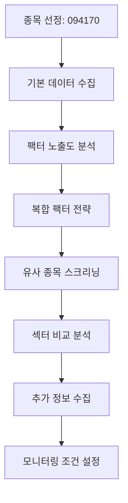

# KRX-Quant Plugin

> KRX(한국거래소) 퀀트 분석 및 종목 발굴 플러그인

## 개요

KRX-Quant는 KOSPI/KOSDAQ 시장의 퀀트 분석을 자동화하는 Claude Code 플러그인입니다. 팩터 분석, 종목 스크리닝, 웹 데이터 수집 기능을 제공합니다.

## 설치

```bash
claude plugins add github:jyyang/claude-marketplace --name krx-quant
```

### 필수 요구사항

- Python 3.9 이상
- Node.js 18 이상

### Python 의존성 설치

```bash
pip install pykrx pandas pyarrow numpy
```

## 빠른 시작

### 0. Ultra 분석 (최대 역량 모드) ⭐

```bash
# 자연어로 요청
"동운아나텍 울트라 분석해서 report/에 저장해줘"

# 또는 명령어로 직접 실행
/ultra-analyze 동운아나텍 report/
/ultra-analyze 094170
```

**Ultra 모드 특징:**
- 3년 가격 데이터 분석
- 15개 전체 팩터 분석
- 30개+ 유사 종목 스크리닝
- 네이버금융/DART 웹 스크래핑
- 투자 스코어카드 (A-F 등급)
- 디렉토리 구조 상세 리포트

### 1. 종합분석 리포트 (일반 모드)

```
# 자연어로 요청
"동운아나텍 매수 타이밍을 포함한 종합분석해서 report/에 저장해줘"

# 또는 명령어로 직접 실행
/stock-report 동운아나텍 report/
/stock-report 094170
```

### 2. 시장 데이터 수집

```
# KOSPI 전체 종목 목록
/krx-collect KOSPI

# 삼성전자 1년 주가 데이터
/krx-collect 005930 20240101 20241231

# KOSDAQ 펀더멘털 데이터
/krx-collect KOSDAQ --detail
```

### 2. 팩터 분석

```
# PER 기준 상위 20개 종목
/factor-analyze PER

# 복합 팩터 분석 (PER + 3개월 모멘텀)
/factor-analyze PER MOM_3M

# 가중치 커스텀
/factor-analyze PER MOM_3M --weights 0.6 0.4

# 특정 종목의 팩터 노출도
/factor-analyze 005930
```

### 3. 종목 스크리닝

```
# 저PER + 고ROE 종목
/stock-screen PER<10 ROE>15

# 대형주 저평가 종목 (한글 지원)
/stock-screen 시총>1조 PBR<1

# 스크리닝 조건 저장
/stock-screen PER<10 --save "저PER전략"

# 저장된 조건 불러오기
/stock-screen --load "저PER전략"
```

## 주요 기능

### Ultra 분석 모드 (`ultra-analyze`) ⭐

모든 krx-quant 기능을 최대 역량으로 활용하는 심층 분석 모드입니다.

**자동 활성화 키워드:** `울트라`, `ultra`, `딥 분석`, `전체 분석`, `심층 분석`

| 항목 | 일반 모드 | Ultra 모드 |
|------|----------|-----------|
| 가격 데이터 | 1년 | 3년 |
| 팩터 분석 | 6개 | 15개 전체 |
| 유사 종목 | 10개 | 30개+ |
| 웹 스크래핑 | 없음 | 네이버금융 + DART |
| 리포트 | 단일 파일 | 디렉토리 구조 |
| 실행 시간 | ~1분 | 3-5분 |

**출력 구조:**
```
{종목명}_ultra_{날짜}/
├── README.md           # 메인 리포트 (20+ 페이지)
├── executive_summary.md
├── data/               # 원시 데이터 (CSV, JSON)
├── analysis/           # 기술적/밸류에이션/팩터 분석
├── screening/          # 스크리닝 결과
└── external/           # 애널리스트 의견, 공시, 매매동향
```

**투자 스코어카드:**
```
┌─────────────┬───────┬───────┐
│ 항목        │ 점수  │ 등급  │
├─────────────┼───────┼───────┤
│ 밸류에이션  │ 1-10  │ A-F   │
│ 성장성      │ 1-10  │ A-F   │
│ 수익성      │ 1-10  │ A-F   │
│ 모멘텀      │ 1-10  │ A-F   │
│ 안정성      │ 1-10  │ A-F   │
│ 종합        │ 1-10  │ A-F   │
└─────────────┴───────┴───────┘
```

### 종합분석 리포트 (`stock-report`)

자연어 요청으로 종합분석 리포트를 자동 생성합니다.

| 요청 패턴 | 예시 |
|----------|------|
| `{종목명} 분석해줘` | "동운아나텍 분석해줘" |
| `{종목명} 종합분석` | "삼성전자 종합분석" |
| `{종목명} 리포트 저장` | "SK하이닉스 리포트 report/에 저장해줘" |
| `{종목코드} 투자분석` | "094170 투자분석" |

**리포트 포함 항목:**
- 기본 정보 및 가격 동향
- 밸류에이션 분석 (PER, PBR, ROE 등)
- 팩터 노출도 (가치/모멘텀/퀄리티/사이즈)
- 유사 종목 비교
- 매수 타이밍 분석
- 투자 의견 요약

### 데이터 수집 (`krx_collect`)

| 데이터 타입 | 설명 | 예시 |
|------------|------|------|
| `tickers` | 종목 목록 | 시장 전체 종목 코드/이름 |
| `ohlcv` | 가격 데이터 | 시가/고가/저가/종가/거래량 |
| `fundamental` | 기본 지표 | PER, PBR, EPS, BPS, 배당수익률 |
| `marketcap` | 시가총액 | 억원 단위 |

### 팩터 분석 (`factor_analyze`)

**지원 팩터 (15개)**

| 카테고리 | 팩터 | 설명 |
|----------|------|------|
| **가치** | PER, PBR, PSR, PCR, EV_EBITDA | 낮을수록 저평가 |
| **모멘텀** | MOM_1M, MOM_3M, MOM_6M, MOM_12M | 높을수록 상승세 |
| **퀄리티** | ROE, ROA, GP_MARGIN, OP_MARGIN | 높을수록 우량 |
| **사이즈** | SIZE, SIZE_INV, VOL_20D | 시가총액/거래량 |

**분석 모드**

1. **단일 팩터 랭킹**: 하나의 팩터로 종목 순위 산출
2. **복합 팩터**: 여러 팩터의 가중 평균 점수
3. **종목 노출도**: 특정 종목의 각 팩터별 점수

### 종목 스크리닝 (`stock_screen`)

**DSL 문법**

```
<조건> ::= <팩터> <연산자> <값>
<연산자> ::= < | > | <= | >= | == | !=
<값> ::= <숫자> | <숫자>조 | <숫자>억 | <숫자>만 | <숫자>%
```

**한글 팩터 별칭**

| 한글 | 영문 |
|------|------|
| 시총, 시가총액 | MARKET_CAP |
| 배당률, 배당수익률 | DIV |

**예시**

```
PER<10              # PER 10 미만
시총>1조            # 시가총액 1조원 초과
배당률>=3%          # 배당수익률 3% 이상
PBR<1 AND ROE>15    # 복합 조건
```

### 웹 스크래핑 (`browser_scrape`)

네이버 금융, DART, KRX 데이터 사이트에서 자동 데이터 수집

| 액션 | 설명 |
|------|------|
| `navigate` | URL 이동 |
| `snapshot` | 페이지 구조 파악 |
| `extract_table` | 테이블 데이터 추출 |
| `extract_list` | 리스트 데이터 추출 |
| `evaluate` | JavaScript 실행 |

## 에이전트

### quant-analyst

팩터 분석 결과 해석 및 투자 전략 제안

```
"삼성전자의 현재 밸류에이션을 팩터 분석해줘"
"가치주 + 모멘텀 복합 전략으로 종목 추천해줘"
```

### stock-screener

자연어를 DSL 조건으로 변환하여 스크리닝 실행

```
"대형주 중에서 저평가된 종목 찾아줘"
"배당수익률 높은 중소형주 스크리닝해줘"
```

### web-scraper

금융 웹사이트 자동 데이터 수집

```
"네이버 금융에서 삼성전자 재무제표 가져와줘"
"DART에서 최근 공시 확인해줘"
```

## 데이터 캐싱

캐시 위치: `.omc/krx-quant/`

```
.omc/krx-quant/
├── data/
│   ├── prices/          # OHLCV 데이터 (Parquet)
│   └── factors/         # 팩터 점수 (Parquet, 24시간 TTL)
└── screens/             # 저장된 스크리닝 조건
```

**캐시 갱신**

```
# 캐시 무시하고 새로 수집
/krx-collect KOSPI --refresh

# 팩터 캐시 갱신
/factor-analyze PER --refresh
```

## 기술 스택

- **MCP Server**: TypeScript + @modelcontextprotocol/sdk
- **Python Bridge**: pykrx + pandas + pyarrow
- **IPC**: Unix Socket + JSON-RPC 2.0

## 에러 코드

| 코드 | 설명 |
|------|------|
| 1001 | pykrx API 오류 |
| 1002 | 잘못된 종목 코드 |
| 1003 | 날짜 형식 오류 (YYYYMMDD) |
| 1004 | 데이터 없음 |
| 1101 | 잘못된 시장 (KOSPI/KOSDAQ) |
| 1201 | 알 수 없는 팩터 |
| 1301 | DSL 파싱 오류 |

## 사용 예시: 동운아나텍 (094170) 분석

동운아나텍(KOSDAQ)을 예시로 krx-quant의 전체 분석 워크플로우를 살펴봅니다.

### Ultra 모드 (원클릭 심층분석)

```bash
# 자연어로 요청
"동운아나텍 울트라 분석해서 report/에 저장해줘"

# 또는 명령어
/ultra-analyze 동운아나텍 report/
```

**예상 출력:**
```
🚀 KRX-Quant Ultra 분석 시작: 동운아나텍 (094170)

Phase 1/6: 데이터 수집 ✓
Phase 2/6: 팩터 분석 (15 factors) ✓
Phase 3/6: 확장 스크리닝 ✓
Phase 4/6: 외부 데이터 수집 ✓
Phase 5/6: 고급 분석 ✓
Phase 6/6: 리포트 생성 ✓

📊 투자 스코어카드
┌─────────────┬───────┬───────┐
│ 항목        │ 점수  │ 등급  │
├─────────────┼───────┼───────┤
│ 밸류에이션  │ 7.5   │ B+    │
│ 수익성      │ 8.2   │ A-    │
│ 모멘텀      │ 7.8   │ B+    │
│ 종합        │ 7.4   │ B+    │
└─────────────┴───────┴───────┘

💡 최종 투자의견: 매수 고려
📁 저장: report/동운아나텍_ultra_20250129/
```

---

### Step 1: 기본 정보 수집

```
# 동운아나텍 최근 1년 주가 데이터 수집
/krx-collect 094170 20240129 20250129

# 펀더멘털 지표 조회 (PER, PBR, EPS, BPS, 배당수익률)
/krx-collect 094170 --detail
```

**예상 출력:**
```json
{
  "ticker": "094170",
  "name": "동운아나텍",
  "market": "KOSDAQ",
  "ohlcv": {
    "2025-01-29": { "open": 8500, "high": 8700, "low": 8400, "close": 8650, "volume": 125000 }
  },
  "fundamental": {
    "PER": 12.5,
    "PBR": 1.8,
    "EPS": 692,
    "BPS": 4805,
    "DIV": 1.2
  }
}
```

### Step 2: 팩터 노출도 분석

```
# 동운아나텍의 전체 팩터 노출도 확인
/factor-analyze 094170
```

**예상 출력:**
```
📊 동운아나텍 (094170) 팩터 노출도

가치 팩터:
  PER:       +0.45 (중립, 시장 평균 수준)
  PBR:       -0.32 (약간 고평가)

모멘텀 팩터:
  MOM_1M:    +1.23 (강한 상승 모멘텀)
  MOM_3M:    +0.87 (양호한 중기 모멘텀)
  MOM_6M:    +0.15 (중립)

퀄리티 팩터:
  ROE:       +0.92 (우수한 수익성)
  GP_MARGIN: +0.68 (양호한 마진)

사이즈:
  SIZE:      -1.05 (소형주)

종합 점수: +0.62 (상위 27%)
```

### Step 3: 복합 팩터 전략 적용

```
# 가치 + 모멘텀 + 퀄리티 복합 분석
/factor-analyze PER MOM_3M ROE --market KOSDAQ --top 30

# 커스텀 가중치로 분석 (가치 40%, 모멘텀 30%, 퀄리티 30%)
/factor-analyze PER MOM_3M ROE --weights 0.4 0.3 0.3 --market KOSDAQ
```

**예상 출력:**
```
📈 KOSDAQ 복합 팩터 랭킹 (PER 40% + MOM_3M 30% + ROE 30%)

순위  종목코드  종목명        복합점수  PER    MOM_3M  ROE
───────────────────────────────────────────────────────
1     036540   SFA반도체     +1.85    +1.2   +1.5    +2.1
2     094170   동운아나텍    +1.42    +0.5   +0.9    +0.9  ← 분석 대상
3     058470   리노공업      +1.38    +0.8   +1.1    +1.2
...
```

### Step 4: 유사 종목 스크리닝

```
# 동운아나텍과 유사한 조건의 종목 찾기
# (KOSDAQ, 시총 1000억~5000억, PER 10~15, ROE 10% 이상)
/stock-screen 시총>1000억 시총<5000억 PER>10 PER<15 ROE>10 --market KOSDAQ

# 조건 저장
/stock-screen 시총>1000억 시총<5000억 PER>10 PER<15 ROE>10 --market KOSDAQ --save "동운아나텍유사"
```

**예상 출력:**
```
🔍 스크리닝 결과: 23개 종목

조건: 시총>1000억, 시총<5000억, PER>10, PER<15, ROE>10

종목코드  종목명        시총(억)  PER    PBR   ROE
─────────────────────────────────────────────────
094170   동운아나텍    2,850    12.5   1.8   14.2%
058470   리노공업      3,200    11.8   2.1   15.8%
036540   SFA반도체     4,100    13.2   1.5   12.5%
...

💾 조건이 "동운아나텍유사"로 저장되었습니다.
```

### Step 5: 섹터 내 비교 분석

```
# KOSDAQ 반도체 장비 섹터에서 동운아나텍 위치 파악
# (자연어로 에이전트에게 요청)
"동운아나텍이 속한 반도체 장비 섹터에서 밸류에이션 비교 분석해줘"
```

**quant-analyst 에이전트 응답 예시:**
```
📊 반도체 장비 섹터 비교 분석

동운아나텍 vs 섹터 평균:
┌─────────────┬──────────┬──────────┬─────────┐
│ 지표        │ 동운아나텍 │ 섹터평균  │ 위치    │
├─────────────┼──────────┼──────────┼─────────┤
│ PER         │ 12.5     │ 18.3     │ 저평가  │
│ PBR         │ 1.8      │ 2.5      │ 저평가  │
│ ROE         │ 14.2%    │ 11.8%    │ 상위    │
│ 영업이익률   │ 12.5%    │ 9.2%     │ 상위    │
│ 3개월 수익률 │ +15.2%   │ +8.7%    │ 상위    │
└─────────────┴──────────┴──────────┴─────────┘

💡 분석 요약:
동운아나텍은 섹터 평균 대비 저평가되어 있으면서
수익성(ROE, 영업이익률)과 모멘텀 모두 우수합니다.
가치+퀄리티+모멘텀 복합 전략에 적합한 종목으로 판단됩니다.
```

### Step 6: 추가 정보 수집 (웹 스크래핑)

```
# 네이버 금융에서 동운아나텍 투자의견 수집
"네이버 금융에서 동운아나텍 애널리스트 투자의견 가져와줘"

# DART에서 최근 공시 확인
"DART에서 동운아나텍 최근 3개월 공시 목록 확인해줘"
```

### Step 7: 모니터링 조건 설정

```
# 동운아나텍 매수 조건 저장 (PER 10 이하로 떨어지면)
/stock-screen 094170 PER<10 --save "동운아나텍매수타이밍"

# 유사 종목 중 모멘텀 상승 종목 모니터링
/stock-screen --load "동운아나텍유사" MOM_1M>0.5 --save "유사종목모멘텀"
```

### 전체 분석 워크플로우 요약



### 자연어 분석 요청 (stock-report 스킬)

자연어로 종합분석을 요청하면 `stock-report` 스킬이 자동 활성화됩니다:

```
# 종합분석 리포트 생성
/stock-report 동운아나텍

# 리포트를 파일로 저장
/stock-report 동운아나텍 report/

# 자연어 요청 (자동 활성화)
"동운아나텍 매수 타이밍을 포함한 종합분석해서 report/에 저장해줘"
"삼성전자 종합분석 리포트 만들어줘"
"094170 투자분석해서 보고서로 저장해줘"
```

**자동 활성화 키워드:**
- `종합분석`, `투자분석`, `분석해줘`
- `리포트`, `보고서`
- `매수타이밍`, `매수 타이밍`

**리포트 포함 내용:**
1. 기본 정보 및 가격 동향
2. 밸류에이션 분석 (PER, PBR, ROE 등)
3. 팩터 노출도 분석
4. 유사 종목 비교
5. 매수 타이밍 분석
6. 투자 의견 요약

## 라이선스

MIT License

## 참고 자료

- [pykrx 문서](https://github.com/sharebook-kr/pykrx)
- [KRX 정보데이터시스템](http://data.krx.co.kr/)
- [DART 전자공시시스템](https://dart.fss.or.kr/)
