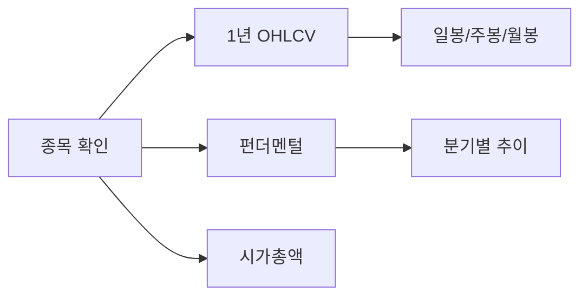

# KRX-Quant Ultra 분석 모드

모든 quant-k 기능을 최대 역량으로 활용하여 심층 종합분석을 수행합니다.

## 자동 활성화 패턴

다음 키워드가 포함된 요청에 자동 활성화됩니다:

- `울트라`, `ultra`
- `딥 분석`, `deep analysis`
- `전체 분석`, `풀 분석`
- `심층 분석`, `최대 분석`
- `완전 분석`, `종합 심층`

**예시:**
```
"동운아나텍 울트라 분석해줘"
"삼성전자 ultra 모드로 분석"
"094170 딥 분석해서 report/에 저장"
"SK하이닉스 전체 분석 실행"
```

## Ultra 모드 vs 일반 모드

| 항목 | 일반 모드 | Ultra 모드 |
|------|----------|-----------|
| 가격 데이터 | 6개월 | 1년 |
| 팩터 분석 | 6개 주요 팩터 | 15개 전체 팩터 |
| 유사 종목 | 10개 | 30개 |
| 섹터 분석 | 평균 비교만 | 전체 섹터 랭킹 |
| 모멘텀 분석 | 3개월 | 1M/3M/6M/12M 전체 |
| 웹 스크래핑 | 없음 | 네이버금융 + DART |
| 리포트 길이 | 요약 | 상세 (20+ 페이지) |
| 차트 데이터 | 없음 | CSV 포함 |
| 백테스트 | 없음 | 팩터 기반 시뮬레이션 |

## Ultra 분석 워크플로우

### Phase 1: 데이터 수집 (Maximum Coverage)



**실행 내용:**
```
# 1-1. 종목 확인 (양 시장 전체 스캔)
krx_collect(dataType: "tickers", market: "KOSPI")
krx_collect(dataType: "tickers", market: "KOSDAQ")

# 1-2. 1년 가격 데이터
krx_collect(dataType: "ohlcv", ticker: "{코드}", startDate: "1년전", endDate: "오늘")

# 1-3. 펀더멘털 (최신)
krx_collect(dataType: "fundamental", ticker: "{코드}")

# 1-4. 시가총액 (시장 전체)
krx_collect(dataType: "marketcap", market: "{시장}")
```

### Phase 2: 전체 팩터 분석 (15 Factors)

```
# 2-1. 종목 팩터 노출도 (전체 15개)
factor_analyze(
  ticker: "{코드}",
  factors: [
    "PER", "PBR", "PSR", "PCR", "EV_EBITDA",     # 가치 5개
    "MOM_1M", "MOM_3M", "MOM_6M", "MOM_12M",     # 모멘텀 4개
    "ROE", "ROA", "GP_MARGIN", "OP_MARGIN",       # 퀄리티 4개
    "SIZE", "VOL_20D"                             # 사이즈 2개
  ]
)

# 2-2. 시장 내 팩터별 순위
factor_analyze(factors: ["PER"], market: "{시장}", topN: 100)
factor_analyze(factors: ["MOM_3M"], market: "{시장}", topN: 100)
factor_analyze(factors: ["ROE"], market: "{시장}", topN: 100)

# 2-3. 복합 팩터 전략 시뮬레이션
factor_analyze(factors: ["PER", "MOM_3M", "ROE"], weights: {"PER": 0.4, "MOM_3M": 0.3, "ROE": 0.3}, market: "{시장}", topN: 50)
```

### Phase 3: 확장 스크리닝 (30+ 유사종목)

```
# 3-1. 유사 밸류에이션 종목
stock_screen(
  conditions: ["시총>{시총*0.3}", "시총<{시총*3}", "PER>{PER*0.5}", "PER<{PER*2}"],
  market: "ALL",
  limit: 30,
  sortBy: "복합팩터점수"
)

# 3-2. 섹터 전체 종목
stock_screen(
  conditions: ["업종=={업종}"],
  market: "{시장}",
  limit: 50
)

# 3-3. 팩터 기반 유망종목
stock_screen(
  conditions: ["PER<15", "ROE>10", "MOM_3M>0"],
  market: "ALL",
  limit: 30
)
```

### Phase 4: 웹 데이터 수집 (External Sources)

```
# 4-1. 네이버 금융 - 투자의견
browser_scrape(
  url: "https://finance.naver.com/item/main.naver?code={코드}",
  action: "extract_table",
  selector: ".consensusTable"
)

# 4-2. 네이버 금융 - 재무제표
browser_scrape(
  url: "https://finance.naver.com/item/coinfo.naver?code={코드}",
  action: "extract_table",
  selector: "#tab_con1 table"
)

# 4-3. DART - 최근 공시
browser_scrape(
  url: "https://dart.fss.or.kr/dsab007/detailSearch.ax?...",
  action: "extract_list"
)

# 4-4. KRX - 투자자별 매매동향
browser_scrape(
  url: "http://data.krx.co.kr/...",
  action: "extract_table"
)
```

### Phase 5: 고급 분석

```
# 5-1. 기술적 분석
- 이동평균선: 5/10/20/60/120/240일
- 볼린저밴드: 20일 기준
- RSI: 14일
- MACD: 12/26/9
- 거래량 분석: 20일 평균 대비

# 5-2. 밸류에이션 적정가 산출
- PER 기반 적정가 (섹터평균/시장평균/역사적평균)
- PBR 기반 적정가
- PSR 기반 적정가
- DCF 간이 추정 (가능시)

# 5-3. 백테스트 시뮬레이션
- 현재 팩터 기준 과거 유사 종목 수익률
- 팩터 전략 과거 성과
```

### Phase 6: Ultra 리포트 생성

```markdown
# {종목명} ({종목코드}) Ultra 분석 리포트

> 생성일: {날짜} | 분석 모드: ULTRA | quant-k v0.1.0

---

## Executive Summary
{핵심 요약 3-5문장}

## 투자 스코어카드
| 항목 | 점수 | 등급 |
|------|------|------|
| 밸류에이션 | {1-10} | {A-F} |
| 성장성 | {1-10} | {A-F} |
| 수익성 | {1-10} | {A-F} |
| 모멘텀 | {1-10} | {A-F} |
| 안정성 | {1-10} | {A-F} |
| **종합** | **{1-10}** | **{A-F}** |

---

## Part 1: 기업 개요
### 1.1 기본 정보
### 1.2 사업 영역
### 1.3 주요 연혁

## Part 2: 주가 분석 (1년)
### 2.1 장기 주가 추이
### 2.2 수익률 분석
### 2.3 변동성 분석
### 2.4 거래량 패턴

## Part 3: 기술적 분석
### 3.1 이동평균선 분석
### 3.2 모멘텀 지표 (RSI, MACD)
### 3.3 볼린저밴드 분석
### 3.4 지지/저항선

## Part 4: 펀더멘털 분석
### 4.1 손익계산서 분석
### 4.2 재무상태표 분석
### 4.3 현금흐름 분석
### 4.4 주요 재무비율

## Part 5: 밸류에이션 심층분석
### 5.1 PER 분석
### 5.2 PBR 분석
### 5.3 PSR/PCR 분석
### 5.4 EV/EBITDA 분석
### 5.5 적정가 산출

## Part 6: 퀀트 팩터 분석
### 6.1 가치 팩터 (5개)
### 6.2 모멘텀 팩터 (4개)
### 6.3 퀄리티 팩터 (4개)
### 6.4 사이즈 팩터 (2개)
### 6.5 복합 팩터 점수
### 6.6 팩터 기반 전략 추천

## Part 7: 섹터 비교 분석
### 7.1 섹터 내 포지션
### 7.2 경쟁사 비교
### 7.3 섹터 트렌드

## Part 8: 유사 종목 분석
### 8.1 밸류에이션 유사 종목 (10개)
### 8.2 팩터 유사 종목 (10개)
### 8.3 시총 유사 종목 (10개)

## Part 9: 외부 데이터
### 9.1 애널리스트 투자의견
### 9.2 최근 공시 요약
### 9.3 투자자별 매매동향
### 9.4 뉴스/이슈 요약

## Part 10: 투자 전략
### 10.1 매수 타이밍 분석
### 10.2 목표가 산정
### 10.3 손절가 제안
### 10.4 포지션 사이징 가이드

## Part 11: 리스크 분석
### 11.1 시장 리스크
### 11.2 기업 고유 리스크
### 11.3 섹터 리스크
### 11.4 리스크 매트릭스

## Part 12: 결론 및 투자의견
### 12.1 강점 요약
### 12.2 약점 요약
### 12.3 기회 요인
### 12.4 위협 요인
### 12.5 최종 투자의견

---

## Appendix
### A. 원시 데이터 (CSV)
### B. 팩터 상세 점수
### C. 스크리닝 전체 결과
### D. 분석 방법론

---

> 본 리포트는 quant-k Ultra 모드에 의해 자동 생성되었습니다.
> 모든 투자 결정은 본인의 판단과 책임 하에 이루어져야 합니다.
```

## 출력 파일 구조

Ultra 모드는 단일 파일이 아닌 디렉토리 구조로 출력:

```
{저장경로}/{종목명}_ultra_{날짜}/
├── README.md                    # 메인 리포트
├── executive_summary.md         # 핵심 요약
├── data/
│   ├── ohlcv_1y.csv            # 1년 가격 데이터
│   ├── fundamental.json        # 펀더멘털 데이터
│   └── factors.json            # 팩터 점수
├── analysis/
│   ├── technical.md            # 기술적 분석
│   ├── valuation.md            # 밸류에이션 분석
│   ├── factor.md               # 팩터 분석
│   └── sector.md               # 섹터 분석
├── screening/
│   ├── similar_valuation.csv   # 유사 밸류에이션 종목
│   ├── similar_factor.csv      # 유사 팩터 종목
│   └── sector_ranking.csv      # 섹터 내 순위
└── external/
    ├── analyst_consensus.md    # 애널리스트 의견
    ├── recent_disclosures.md   # 최근 공시
    └── investor_trend.md       # 투자자 동향
```

## 사용법

### 명령어
```bash
/ultra-analyze 동운아나텍
/ultra-analyze 094170 report/
/ultra-analyze 삼성전자 --output ./analysis/
```

### 자연어
```
"동운아나텍 울트라 분석해줘"
"삼성전자 ultra 모드로 전체 분석해서 report/에 저장"
"094170 딥 분석 실행"
"SK하이닉스 심층 분석 리포트 만들어줘"
```

## 예상 실행 시간

| 단계 | 예상 시간 |
|------|----------|
| Phase 1: 데이터 수집 | 30-60초 |
| Phase 2: 팩터 분석 | 20-30초 |
| Phase 3: 스크리닝 | 15-20초 |
| Phase 4: 웹 스크래핑 | 60-120초 |
| Phase 5: 고급 분석 | 30-45초 |
| Phase 6: 리포트 생성 | 20-30초 |
| **전체** | **3-5분** |

## 콘솔 출력 예시

```
🚀 KRX-Quant Ultra 분석 시작: 동운아나텍 (094170)

━━━━━━━━━━━━━━━━━━━━━━━━━━━━━━━━━━━━━━━━━━━━━━━━━━━
Phase 1/6: 데이터 수집
━━━━━━━━━━━━━━━━━━━━━━━━━━━━━━━━━━━━━━━━━━━━━━━━━━━
  ✓ 종목 확인: 동운아나텍 (094170, KOSDAQ)
  ✓ 1년 OHLCV 수집: 250 거래일
  ✓ 펀더멘털 수집: PER 12.5, PBR 1.8, ROE 14.2%
  ✓ 시가총액: 2,850억원

━━━━━━━━━━━━━━━━━━━━━━━━━━━━━━━━━━━━━━━━━━━━━━━━━━━
Phase 2/6: 팩터 분석 (15 factors)
━━━━━━━━━━━━━━━━━━━━━━━━━━━━━━━━━━━━━━━━━━━━━━━━━━━
  가치팩터:   PER +0.45 | PBR -0.32 | PSR +0.12 | PCR +0.28 | EV/EBITDA +0.15
  모멘텀:    1M +1.23 | 3M +0.87 | 6M +0.15 | 12M -0.22
  퀄리티:    ROE +0.92 | ROA +0.68 | GP +0.45 | OP +0.55
  사이즈:    SIZE -1.05 | VOL +0.32

  ✓ 복합 점수: +0.62 (상위 27%)

━━━━━━━━━━━━━━━━━━━━━━━━━━━━━━━━━━━━━━━━━━━━━━━━━━━
Phase 3/6: 확장 스크리닝
━━━━━━━━━━━━━━━━━━━━━━━━━━━━━━━━━━━━━━━━━━━━━━━━━━━
  ✓ 유사 밸류에이션: 28개 종목
  ✓ 동일 섹터: 45개 종목
  ✓ 팩터 유망종목: 32개 종목

━━━━━━━━━━━━━━━━━━━━━━━━━━━━━━━━━━━━━━━━━━━━━━━━━━━
Phase 4/6: 외부 데이터 수집
━━━━━━━━━━━━━━━━━━━━━━━━━━━━━━━━━━━━━━━━━━━━━━━━━━━
  ✓ 네이버금융 투자의견: 매수 3, 보유 1, 매도 0
  ✓ 네이버금융 재무제표: 최근 4분기
  ✓ DART 공시: 최근 10건
  ✓ 투자자 매매동향: 외국인 순매수 +125억

━━━━━━━━━━━━━━━━━━━━━━━━━━━━━━━━━━━━━━━━━━━━━━━━━━━
Phase 5/6: 고급 분석
━━━━━━━━━━━━━━━━━━━━━━━━━━━━━━━━━━━━━━━━━━━━━━━━━━━
  ✓ 기술적 분석: 20MA 상향돌파, RSI 58 (중립)
  ✓ 적정가 산출: 9,800원 (현재가 대비 +13%)
  ✓ 백테스트: 유사팩터 종목 평균 +18% (6개월)

━━━━━━━━━━━━━━━━━━━━━━━━━━━━━━━━━━━━━━━━━━━━━━━━━━━
Phase 6/6: 리포트 생성
━━━━━━━━━━━━━━━━━━━━━━━━━━━━━━━━━━━━━━━━━━━━━━━━━━━
  ✓ 메인 리포트: 24 페이지
  ✓ 데이터 파일: 5개
  ✓ 분석 파일: 4개
  ✓ 스크리닝 결과: 3개

━━━━━━━━━━━━━━━━━━━━━━━━━━━━━━━━━━━━━━━━━━━━━━━━━━━
🎯 Ultra 분석 완료!
━━━━━━━━━━━━━━━━━━━━━━━━━━━━━━━━━━━━━━━━━━━━━━━━━━━

📊 투자 스코어카드
┌─────────────┬───────┬───────┐
│ 항목        │ 점수  │ 등급  │
├─────────────┼───────┼───────┤
│ 밸류에이션  │ 7.5   │ B+    │
│ 성장성      │ 6.8   │ B     │
│ 수익성      │ 8.2   │ A-    │
│ 모멘텀      │ 7.8   │ B+    │
│ 안정성      │ 6.5   │ B     │
├─────────────┼───────┼───────┤
│ 종합        │ 7.4   │ B+    │
└─────────────┴───────┴───────┘

💡 최종 투자의견: 매수 고려
   - 섹터 대비 저평가 + 상승 모멘텀 + 우수한 수익성
   - 목표가: 9,800원 (+13%)
   - 손절가: 7,800원 (-10%)

📁 저장 완료: report/동운아나텍_ultra_20250129/
   └── README.md (메인 리포트)
   └── data/ (원시 데이터 5개)
   └── analysis/ (분석 파일 4개)
   └── screening/ (스크리닝 결과 3개)
   └── external/ (외부 데이터 3개)
```

## 에러 처리

| 상황 | 처리 |
|------|------|
| 웹 스크래핑 실패 | 해당 섹션 스킵, 나머지 분석 계속 |
| 데이터 부족 | 가능한 데이터만으로 부분 리포트 |
| 1년 데이터 없음 | 가용 기간으로 축소 |
| 저장 실패 | 콘솔에 전체 출력 |
